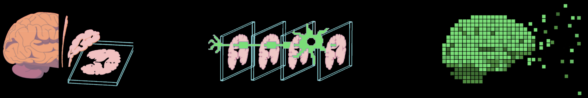

<!-- URL of the post: https://glebrazgar.github.io/Duality/ -->

<!-- STYLING THE PAGE -->

<!-- Ensure proper viewport setting -->
<meta name="viewport" content="width=device-width, initial-scale=1.0, maximum-scale=1.0, user-scalable=no">

<!-- Navigation buttons -->

  <button class="nav-button" onclick="document.getElementById('contact-section').scrollIntoView({behavior: 'smooth'})">Get in Touch</button>
  <button class="nav-button" onclick="document.getElementById('team-section').scrollIntoView({behavior: 'smooth'})">Team</button>
  <button class="nav-button" onclick="window.location.href='https://glebrazgar.github.io/Connectomics/'">Research</button>

<!-- URL of the post: https://glebrazgar.github.io/Duality/ -->

<!-- FINISH STYLING THE PAGE -->

<!-- Motivation section as centered italic text -->

  We don't understand the brain - and thus can't cure it, augment it, or replicate it.  

  Brain uploading will solve this.

<!-- Objective section with title on left, content on right (standard layout) -->

  

    
Mission

  

  

    At Duality we are working towards digitizing the first human brain to unlock new forms of medicine such as: simulation of brain diseases, emulation of new drug treatments, development of human-like AI, and maybe one-day - digital imortality.
  

<!-- Approach section with content on left, title on right (reversed layout) -->

  

    
Approach

  

  

    
As sci-fi as it sounds, brain uploading has already been achieved with insects and animals. Our efforts attempt to scale this research to humans.

    
To accelerate this effort we are building two key frontiers:

    
<strong>1. Automated Imaging Engine</strong> (to make nano-scale brain uploading 100x cheaper and 1000x faster)

    
<strong>2. Simulation Engine</strong> (to make brain data simulatable)

  

<!-- Approach visualization image -->

  

<!-- Team section with centered title and image properly integrated -->

  
Team

  

  

    <button class="contact-button" onclick="window.location.href='https://glebrazgar.github.io/Duality-Contact/'">Get in Touch</button>
  

<!-- Custom Footer - make sure this is the last element -->

  

    
Duality

    
Digitizing the human brain

    

      <a href="https://www.linkedin.com/in/gleb-razgar-6931a7220" class="footer-link">LinkedIn</a>
      <a href="https://glebrazgar.github.io/Duality-Contact/" class="footer-link">Contact</a>
      <a href="https://glebrazgar.github.io/Connectomics/" class="footer-link">Research</a>
    

    
© 2025 Duality. All rights reserved.

  

<!-- End of page content - nothing should be after this -->

