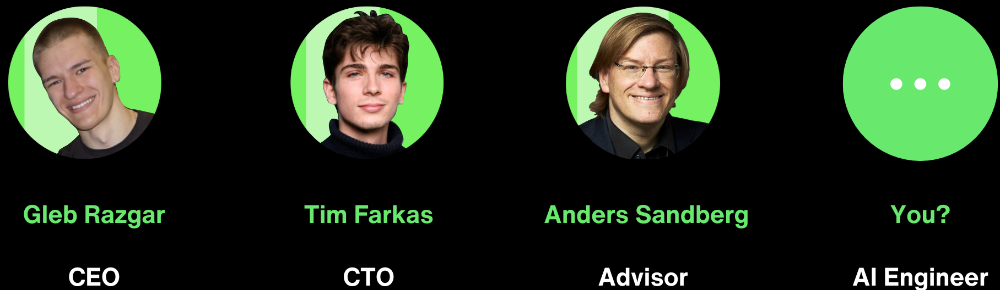

<!-- URL of the post: https://glebrazgar.github.io/Duality/ -->

<!-- STYLING THE PAGE -->

<!-- URL of the post: https://glebrazgar.github.io/Duality/ -->

<!-- FINISH STYLING THE PAGE -->

<h3 align="center">Overview</h3>

  
Motivation

  

    We don't understand the brain - and thus can't cure it, augment it, or replicate it's intelligence. At Duality we are working towards solving this by digitizing the first human brain. Success would unlock a new form of medicine - enabling simulation of brain diseases, emulation of new drug treatments, development of human-like AI, and transcendance of human death.
  

  
Objective

  

    As sci-fi as it sounds, brain uploading has already been successfully done with insects and animals. Duality's efforts attempt to scale the same line of research to much bigger - human brains. Our goal is to create the first complete human brain simulation that preserves both structure and function.
  

  
Approach

  

    To do so, we are building two key frontiers:  
    <strong>1. Automating Uploading Engine</strong> (to make nano-scale brain imaging 100x cheaper and 1000x faster)  
    <strong>2. Simulation Engine</strong> (to make brain data simulatable)  
    For more details about our research and commercial efforts - <a href="https://www.linkedin.com/in/gleb-razgar-6931a7220">get in touch</a>
  

**Duality is a startup / lab building toward human brain uploading.**

We don't understand the brain - and thus can't cure it, augment it, or replicate it's intelligence. 

At Duality we are working towards solving this by digitizing the first human brain. Success would unlock new forms of medicine - enabling simulation of brain diseases, emulation of new drug treatments, development of human-like AI, and in some people's eyes - transcendance of human death.

As sci-fi as it sounds, brain uploading has already been successfully done with insects and animals. Duality's efforts attempt to scale the same line of research to much bigger - human brains.

To do so, we are building two key frontiers:  
**1. Automating Uploading Engine** (to make nano-scale brain imaging 100x cheaper and 1000x faster)  
**2. Simulation Engine** (to make brain data simulatable)

For more details about our research and commercial efforts - [get in touch](https://www.linkedin.com/in/gleb-razgar-6931a7220)

  <table style="width: 100%; border-collapse: collapse;">
    <tr>
      <td style="width: 33.33%; text-align: center;">
        CEO 
        <a href="linkedin.com/in/gleb-razgar-6931a7220">Gleb Razgar</a>
      </td>
      <td style="width: 33.33%; text-align: center;">
        CTO 
        <a href="https://www.linkedin.com/in/tim-farkas/">Tim Farkas</a>
      </td>
      <td style="width: 33.33%; text-align: center;">
        Advisor 
        <a href="https://www.linkedin.com/in/anders-sandberg-9215ab145/">Anders Sandberg</a>
      </td>
    </tr>
  </table>

