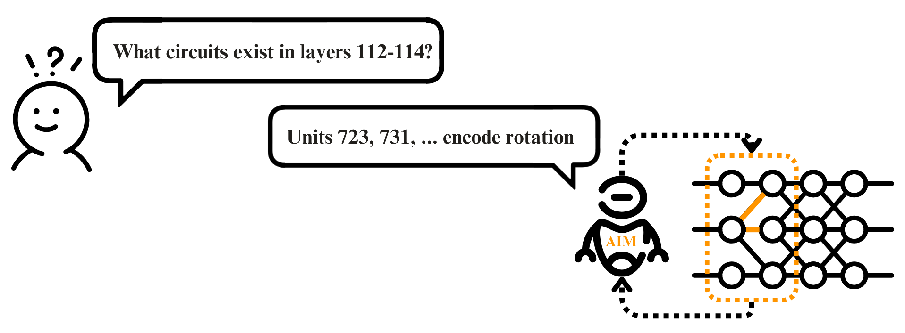

  

<table>
  <tr>
    <td align="center">Gleb Razgar <a href="mailto:gleb.razgar@gmail.com">gleb.razgar@gmail.com</a></td>
    <td align="center">Simon Malzard <a href="mailto:piyush@turing.ac.uk">salmon.malzard@turing.ac.uk</a></td>
    <td align="center">Piyush Ahuia <a href="mailto:piyush@turing.ac.uk">piyush@turing.ac.uk</a></td>
    <td align="center">Nitish Mital <a href="mailto:nitish.m@cam.ac.uk">nitish.m@cam.ac.uk</a></td>
  </tr>
</table>

---

<h3 align="center">Abstract</h3>

In this paper we propose Automated Interpretability Modelling (AIM) -
a method that uses neural models to automate mechanistic
interpretability experiments like circuit discovery and
explainability. At its core, AMI utilises a pre-trained
vision-language model with the capacity to extract
sparse representations, compose and modify inputs, assess circuit
activations, and summarize experimental results - all to support
iterative experiments that explain neural network behaviours. We test
AIMs prowess in computer vision, where it decodes neural and circuit
features in models learned image representations. Using trained models
and ground-truth neurons as our testing ground, AIM matches - and
often surpasses human experts in decoding neural features.

  
  

<h3 align="center">1. Introduction</h3>

Mechanistic interpretability is in effect unconstrained neuroscience. It
holds no risk, and almost no physical friction. Yet, despite being less
constrained, our understanding of models is proportionally shrinking.
For one, exponential increase in model complexity outpaces or
interpretability efforts, and for two, there is a scarcity of
interpretability researchers. Interpreting a neural network is a
multi-faceted enterprise. When auditing circuits we might need to detect
demographic biases, surface systematic errors, or identify architectural
improvements. These audits demand intensive researcher experience---from
hypothesis formation to conducting experiments and result
analysis (Nushi et al., 2018; Zhang et al., 2018) --- creating weighty
barriers for people outside of the field. Recent work on automated
interpretability attempted to alleviate this by allowing the models to
analyse themselves through synthesizing description of their learned
representations (Shaham et al., 2024). But these approaches remain
confined to single-neuron interpretability which limits the scope of
behavioural analysis (Huang et al., 2023). Thus, here stands our
decisive challenge: how to build tools that scale interpretability
beyond expert analysis while preserving the scientific method.

<p1 style="text-align: center;">Fig1: High level overview of the AIM system</p1>

This paper introduces AIM (Automated Interpretability Model), a system
that combines a vision-language model for neural network analysis. AIMs
modular architecture enables systematic evaluation of model behavior
through programmatically constructed experiments. Given an
interpretability query, AIM generates, executes, and analyses targeted
experiments using it's components (Figure 1). Section 3 details
the systems technical components, including modules for image synthesis
and editing that enable direct hypothesis testing. For evaluation, we
develop a benchmark dataset of synthetic neurons with text-specified
ground-truth selectivity, built from an open-set concept detector. We
assess AIM through the neuron description paradigm---a fundamental
component in interpretability workflows (Bau et al., 2017; 2020;
Oikarinen & Weng, 2022; Bills et al., 2023; Singh et al., 2023;
Schwettmann et al., 2023).

Experimental results in Section 4 demonstrate that AIMs
descriptions achieve higher behavioral predictivity than baselines for
both synthetic and real neurons, approaching human-level performance. We
extend this framework to model-level interpretation tasks, applying
AIMs iterative experimental approach to downstream applications
including spurious feature removal and bias detection. These
applications demonstrate the systems extensibility: novel tasks are
specified via prompts, which AIM translates into experimental programs.

Current limitations require human oversight to address confirmation bias
and sampling adequacy. Full automation of model interpretation
necessitates both advanced tooling and improved experimental reasoning
capabilities.
  

<h3 style="text-align: center;">1. Related Work</h3>

<h4 style="font-weight: 500;">Interpretability</h4>
Interpreting deep features has progressed through several
methodological advances. Initial investigations of individual neurons
in deep networks established methods for understanding learned features
through direct visualization (Zhou et al., 2018; Bau et al., 2020; Goh
et al., 2021) and identification of maximally-activating inputs
from real-world datasets (Mu & Andreas, 2020; Carter et al., 2019;
Lillian et al., 2022). Early approaches to automated interpretation
translated visual exemplars into language descriptions using fixed
vocabularies (Park et al., 2019; Hendricks et al., 2018) or programmatic
specifications (Mu & Andreas, 2020).

**Circuit Identification**  
Identifying circuits in neural networks has revealed fundamental
computational patterns. Early work established methods for
discovering and validating circuits through techniques like activation
clustering, feature attribution, and causal intervention (McGill &
Fergus, 2021; Sundararajan et al., 2020). Circuit analysis has since
expanded to include automated discovery of computational motifs (Lange
et al., 2022), systematic study of attention heads (Anthropic, 2023),
and investigation of specific capabilities like indirect object
identification (Lindner et al., 2023) and mathematical reasoning (Zhang
et al., 2023). Recent work has also developed automated tools for
circuit discovery, including approaches based on gradient flow
(Fiacco et al., 2023), activation patterns (Li et al., 2023), and
targeted interventions (Cunningham et al., 2023). However, these methods
require significant manual effort to design and execute experiments,
limiting their utility and accessibility to researchers without deep
expertise in circuit analysis.

**Automated Interpretability via Agents**  
Subsequent work on automated interpretability developed methods for
generating open-ended descriptions of learned features, either curated
from human labelers (Anthropic, 2023) or generated directly by learned
models (OpenAI, 2023; DeepMind, 2023; Anthropic, 2023). However, these
approaches produced unreliable or causal descriptions of model behavior
without further experimentation (Stanford, 2023). Recent work introduced
automated experimentation protocols using language model agents, though
these operated purely on language-based exploration of inputs, limiting
their action space. When deployed as agents with access to analytical
tools, language models can now perform multi-step reasoning tasks
in complex environments (Google, 2023), generate and test hypotheses
about neural networks trained on vision tasks (Meta, 2023), and leverage
image-based tools (DeepMind, 2023). While ordinary LM agents are
generally restricted to textual interfaces, recent work has demonstrated
interaction with vision systems through code generation (Anthropic,
2023; OpenAI, 2023). Large multimodal language models have expanded
these capabilities further, enabling direct image-based interaction
with neural networks.  

{width="4.97249in" height="2.47522in"}
  

<h3 align="center">3. AIM Framework</h3>

**3. AIM Model**  
AIM is an automated interpretability engine that designs and executes
experimental code programs to analyze neural networks. The system
combines a multimodal language model backbone with a specialized API for
interpretability experiments, enabling iterative hypothesis testing and
analysis.

**Architecture**  
At its core, AIM uses Gemini (DeepMind, 2023b) as its reasoning engine,
allowing direct processing of both visual and textual information. The
system operates through two primary components:

1\) **Structure** that provides access to the target neural network
through a Sparse Auto Encoder (SAE),

2\) **Tools** that implement experimental primitives. These components
are exposed through a Python-based MAIA API that enables programmatic
composition of interpretability experiments (Shaham et al., 2024).

**Operation**  
Given an interpretability query (e.g., analyzing neuron selectivity or
identifying failure modes), AIM constructs a series of experimental
programs. Each program tests specific hypotheses by manipulating inputs,
measuring activations, and analyzing results. The system iteratively
refines its understanding based on experiments until it can address the
original query.

**Implementation**  
AIM uses MAIA's implementation to generate executable Python code
(Shaham et al., 2024) that leverages standard scientific computing
libraries, including PyTorch for neural network operations. The systems
design builds on recent advances in tool-use by language models (Surís
et al., 2023; Gupta & Kembhavi, 2023), while specifically addressing the
requirements of iterative neural network analysis.

{width="6.26389in" height="8.86389in"}

**Figure 3:**

**Some description!**

**3.1. System**  
The System class in AIM provides programmatic access to internal
components of the target neural network. This instrumentation enables
fine-grained experimental control over individual model elements. For
instance, when analyzing neurons in a vision transformer's MLP block,
AIM initializes a layer or neuron object by specifying its location and
model context:

system = System(unit_id, layer_id, model_name)

The System class supports targeted experiments through methods like
system.neuron(image_list), which returns both activation values and
activation-weighted visualizations highlighting influential image
regions from the SAE (Figure 2). Unlike existing approaches to neuron
interpretation that require task-specific model training (Hernandez et
al., 2022), AIMs System class enables direct experimentation on
arbitrary vision systems using an SAE.

**3.2. Tools**  
The Tools provides a modular framework for hypothesis testing through
programmatic experiments. Building on established interpretability
methods and kits (Shaham et al., 2024), these tools incorporate
procedures for analysing circuits with real-world images (Bau et al.,
2017) and performing causal interventions on inputs (Hernandez et al.,
2022; Casper et al., 2022). AIM composes these fundamental operations
into more sophisticated experimental programs (Figure 2).

During execution, the systems Python implementation enables integration
with external models and libraries. For instance,
tools.game_engine(prompt_list) leverages a text-guided game engine model
to generate synthetic images in a game environment, allowing AIM to test
neuron responses to specific visual concepts. The modular architecture
facilitates straightforward incorporation of new interpretability
methods as they emerge. For the experiments in this paper, we
implement the following set of tools:

**Dataset Exemplar Generation**  
The system identifies prototypical circuit behavior by analyzing
activation patterns across large image datasets (Bau et al., 2017; Zhou
et al., 2017; 2020). This functionality is implemented through ImageNet
validation set analysis (Deng et al., 2009), with AIM typically
beginning experimentation by retrieving the top-5 maximally activating
images for the target system (Figure 2, Section 4.3).

**Image Generation and Editing Tools**  
AIM employs Unity Game engine with Moose, as well as Stable Diffusion
v1.5 (Rombach et al., 2022) for image synthesis via text2image(prompt).
This enables both testing system sensitivity to specific visual concepts
and evaluating concept consistency across contexts (Figure 2). The
edit_image(image, edit_instructions) function, building on
InstantID/IPix (Brooks et al., 2023), supports targeted image
modifications for testing specific hypotheses, such as transforming
object attributes while preserving background context.

**Image Description and Summarization Tools**  
For experimental result analysis, AIM leverages Gemini to
describe(image_list) individual images or summarize(image_list) shared
characteristics across image sets. This multi-agent framework enables
iterative refinement of visual hypotheses based on experimental
outcomes.

**Experiment Log**  
The log_experiment tool records experimental results (e.g., activations,
modifications) and maintains an accessible history for subsequent
analysis. AIM uses this log to track hypothesis evolution, neural
circuits and evidence accumulation throughout the
interpretation process.

**4. Evaluation**  
AIM is evalueated across three dimensions:

1\) Behavior prediction accuracy for neurons and circuits in trained
architecture

2\) Performance on synthetic neurons with known ground-truth selectivity

3\) Comparative analysis against the MILAN baseline (Hernandez et al.,
2022) and human experts using the AIM.

The framework enables interpretability tasks through natural language
specification in the VLM prompt. We evaluate this capability through a
series of increasingly complex experiments, focusing initially on neuron
description---a fundamental interpretability task with applications in
model auditing and editing (Gandelsman et al., 2024; Yang et al., 2023;
Hernandez et al., 2022).

**4.1. Cross-Architecture Evaluation**  
We evaluate AIM on neurons from three architectures: ResNet-152 for
supervised classification (He et al., 2016), DINO for unsupervised
representation learning (Caron et al., 2021; Grill et al., 2020; Chen &
He, 2021), and CLIPs ResNet-50 visual encoder for image-text
alignment (Radford et al., 2021). From each architecture, we sample 100
units across representative layers (ResNet-152 conv.1, res.1-4; DINO
MLP 1-11; CLIP res.1-4), with example experiments and labels shown in
Figure 2.

Our evaluation framework assesses description accuracy through
behavioral prediction on unseen test images, building on contrastive
evaluation approaches (Gardner et al., 2020; Kaushik et al., 2020). We
compare three description methods: AIMs interactive analysis, MILANs
static dataset exemplar labeling (Hernandez et al., 2022), and human
experts using the AIM API on a 25% subset (Appendix C1). For each
description, GPT-4 generates seven positive and seven neutral exemplar
prompts, which are then paired with descriptions by a separate GPT-4
instance based on predicted relevance. We measure neuron activations on
the generated images to assess prediction accuracy.

Results demonstrate AIMs superior performance over MILAN across all
architectures, with accuracy often matching human experts (Figure 4).
Layer-specific analyses are detailed in Table A3.\"

**5. Applications**  
AIM is a flexible system that automates model understanding tasks at
different levels of granularity: from labeling individual features to
diagnosing model-level failure modes. To demonstrate the utility of AIM
for producing actionable insights for human users (Vaughan & Wallach,
2020), we conduct experiments that apply AIM to two model-level tasks:
(i) spurious feature removal and (ii) bias identification in a
downstream classification task. In both cases AIM uses the API as
described in Section 3.

**5.1. Feature Decontamination**  
Polysemantic features present significant challenges when deploying
models under distribution shift (Storkey et al., 2009; Beery et al.,
2018; Bissoto et al., 2020; Xiao et al., 2020; Singla et al., 2021). We
evaluate AIMs ability to identify and remove such features in a
classification network where dog breeds are contaminated correlated with
backgrounds in training but decorrelated in testing (Figure 8). Unlike
methods requiring balanced data (Kirichenko et al., 2023), AIM
identifies robust features using only unbalanced validation
set examples. From 50 initially selected informative neurons (via ℓ1
regularization), AIM identifies 22 robust neurons through targeted
experiments. A logistic regression model trained on these neurons
significantly improves accuracy under distribution shift (Table 2),
achieving performance comparable to balanced-data approaches despite
using only unbalanced data. Comparative experiments with ℓ1
regularization on both balanced and unbalanced datasets validate that
AIMs performance stems from meaningful feature selection rather than
mere sparsity (detailed in Appendix F2).

**5.2. Revealing prejudice**  
We demonstrate AIMs capability to automatically surface model-level
biases in a supervised ImageNet CNN (ResNet-152) classifier. Given a
target class, AIM instruments the system class to analyze output
probabilities and synthesizes images to identify ranking biases.
The system generates class-label pairs with unexpectedly low
probabilities and clear reference sets (see Appendix G). In a simple
experiment targeting ImageNet classes, AIMs synthetic data generation
reveals regions of poor model performance, surfacing broad failure
categories. Additional experiments validate these findings
across diverse bias types.

**6. Conclusion**  
We present AIM, a system that automates interpretability workflows
through programmatic experimentation on neural networks. While current
limitations necessitate human oversight for error detection and
confirmation bias mitigation, our experimental results demonstrate
AIMs potential as interpretability tools grow in sophistication.

**7. Impact statement**  
The increasing deployment of high-stakes AI systems necessitates robust
interpretability methods. AIM represents an initial step toward
systematic, automated auditing capabilities. However, we emphasize that
AIMs current limitations---particularly in confirmation bias and image
generation reliability---require human supervision. While AIM enables
causal interventions for behavioral analysis, negative results should
not be interpreted as definitive evidence of absence. Future work should
focus on developing more rigorous verification methods and expanding the
experimental toolkit.\"

**References**

Bau, D., Zhou, B., Khosla, A., Oliva, A., and Torralba, A. Network
dissection: Quantifying interpretability of deep visual representations.
In Computer Vision and Pattern Recognition, 2017.

Bau, D., Zhu, J.-Y., Strobelt, H., Lapedriza, A., Zhou, B., and
Torralba, A. Understanding the role of individual units in a deep neural
network. Proceedings of the National Academy of Sciences, 2020. ISSN
0027-8424. doi: 10.1073/pnas. 1907375117. URL https://www.pnas.org/
content/early/2020/08/31/1907375117.

Beery, S., Van Horn, G., and Perona, P. Recognition in terra incognita.
In Proceedings of the European conference on computer vision (ECCV), pp.
456--473, 2018.

Bills, S., Cammarata, N., Mossing, D., Tillman, H., Gao, L., Goh, G.,
Sutskever, I., Leike, J., Wu, J., and Saunders, W. Language models can
explain neurons in language models. https:
//openaipublic.blob.core.windows.net/ neuron-explainer/paper/index.html,
2023.

Bissoto, A., Valle, E., and Avila, S. Debiasing skin lesion datasets and
models? not so fast. In Proceedings of the IEEE/CVF Conference on
Computer Vision and Pattern Recognition Workshops, pp. 740--741, 2020.

Brooks, T., Holynski, A., and Efros, A. A. Instructpix2pix: Learning to
follow image editing instructions. arXiv preprint arXiv:2211.09800,
2022.

Caron, M., Touvron, H., Misra, I., Jegou, H., Mairal, J., ´ Bojanowski,
P., and Joulin, A. Emerging properties in self-supervised vision
transformers. In Proceedings of the IEEE/CVF international conference on
computer vision, pp. 9650--9660, 2021.

Casper, S., Hariharan, K., and Hadfield-Menell, D. Diagnostics for deep
neural networks with automated copy/paste attacks. arXiv preprint
arXiv:2211.10024, 2022.

Chen, L., Zhang, Y., Ren, S., Zhao, H., Cai, Z., Wang, Y., Wang, P.,
Liu, T., and Chang, B. Towards end-to-end embodied decision making via
multi-modal large language model: Explorations with gpt4-vision and
beyond, 2023.

Chen, X. and He, K. Exploring simple siamese representation learning. In
Proceedings of the IEEE/CVF conference on computer vision and pattern
recognition, pp. 15750--15758, 2021.

Conmy, A., Mavor-Parker, A. N., Lynch, A., Heimersheim, S., and
Garriga-Alonso, A. Towards automated circuit discovery for mechanistic
interpretability. arXiv preprint arXiv:2304.14997, 2023.

Dalvi, F., Durrani, N., Sajjad, H., Belinkov, Y., Bau, A., and Glass, J.
What is one grain of sand in the desert? analyzing individual neurons in
deep nlp models. In Proceedings of the AAAI Conference on Artificial
Intelligence, volume 33, pp. 6309--6317, 2019.

Deng, J., Dong, W., Socher, R., Li, L.-J., Li, K., and Fei-Fei, L.
Imagenet: A large-scale hierarchical image database. In 2009 IEEE
conference on computer vision and pattern recognition, pp. 248--255.
Ieee, 2009.

Fong, R. and Vedaldi, A. Net2vec: Quantifying and explaining how
concepts are encoded by filters in deep neural networks. In Proceedings
of the IEEE conference on computer vision and pattern recognition, pp.
8730--8738, 2018.

Gandelsman, Y., Efros, A. A., and Steinhardt, J. Interpreting clip's
image representation via text-based decomposition, 2024.

Gardner, M., Artzi, Y., Basmova, V., Berant, J., Bogin, B., Chen, S.,
Dasigi, P., Dua, D., Elazar, Y., Gottumukkala, A., Gupta, N.,
Hajishirzi, H., Ilharco, G., Khashabi, D., Lin, K., Liu, J., Liu, N. F.,
Mulcaire, P., Ning, Q., Singh, S., Smith, N. A., Subramanian, S.,
Tsarfaty, R., Wallace, E., Zhang, A., and Zhou, B. Evaluating models'
local decision boundaries via contrast sets, 2020.

Girshick, R., Donahue, J., Darrell, T., and Malik, J. Rich feature
hierarchies for accurate object detection and semantic segmentation. In
Proceedings of the IEEE conference on computer vision and pattern
recognition, pp. 580--587, 2014.

Grill, J.-B., Strub, F., Altche, F., Tallec, C., Richemond, P., ´
Buchatskaya, E., Doersch, C., Avila Pires, B., Guo, Z., Gheshlaghi Azar,
M., et al. Bootstrap your own latent-a new approach to self-supervised
learning. Advances in neural information processing systems,
33:21271--21284, 2020.

Gupta, T. and Kembhavi, A. Visual programming: Compositional visual
reasoning without training. In Proceedings of the IEEE/CVF Conference on
Computer Vision and Pattern Recognition, pp. 14953--14962, 2023.

Gurnee, W., Nanda, N., Pauly, M., Harvey, K., Troitskii, D., and
Bertsimas, D. Finding neurons in a haystack: Case studies with sparse
probing. arXiv preprint arXiv:2305.01610, 2023.

He, K., Zhang, X., Ren, S., and Sun, J. Deep residual learning for image
recognition. In Proceedings of the IEEE conference on computer vision
and pattern recognition, pp. 770--778, 2016.

Hernandez, E., Schwettmann, S., Bau, D., Bagashvili, T., Torralba, A.,
and Andreas, J. Natural language descriptions of deep visual features.
In International Conference on Learning Representations, 2022.

Huang, J., Geiger, A., D'Oosterlinck, K., Wu, Z., and Potts, C.
Rigorously assessing natural language explanations of neurons. arXiv
preprint arXiv:2309.10312, 2023.

Karpathy, A., Johnson, J., and Fei-Fei, L. Visualizing and understanding
recurrent networks. arXiv preprint arXiv:1506.02078, 2015.

Kaushik, D., Hovy, E., and Lipton, Z. C. Learning the difference that
makes a difference with counterfactuallyaugmented data, 2020.

Kirichenko, P., Izmailov, P., and Wilson, A. G. Last layer re-training
is sufficient for robustness to spurious correlations, 2023.

Kirillov, A., Mintun, E., Ravi, N., Mao, H., Rolland, C., Gustafson, L.,
Xiao, T., Whitehead, S., Berg, A. C., Lo, W.-Y., Dollar, P., and
Girshick, R. Segment anything. ´ arXiv:2304.02643, 2023.

Kluyver, T., Ragan-Kelley, B., Perez, F., Granger, B., Bus- ´ sonnier,
M., Frederic, J., Kelley, K., Hamrick, J., Grout, J., Corlay, S.,
Ivanov, P., Avila, D., Abdalla, S., and Willing, C. Jupyter notebooks --
a publishing format for reproducible computational workflows. In
Loizides, F. and Schmidt, B. (eds.), Positioning and Power in Academic
Publishing: Players, Agents and Agendas, pp. 87 -- 90. IOS Press, 2016.

Liu, S., Zeng, Z., Ren, T., Li, F., Zhang, H., Yang, J., Li, C., Yang,
J., Su, H., Zhu, J., et al. Grounding dino: Marrying dino with grounded
pre-training for open-set object detection. arXiv preprint
arXiv:2303.05499, 2023.

Liu, Z., Luo, P., Wang, X., and Tang, X. Deep learning face attributes
in the wild, 2015.

Lynch, A., Dovonon, G. J.-S., Kaddour, J., and Silva, R. Spawrious: A
benchmark for fine control of spurious correlation biases, 2023.

Mahendran, A. and Vedaldi, A. Understanding deep image representations
by inverting them. In Proceedings of the IEEE conference on computer
vision and pattern recognition, pp. 5188--5196, 2015.

Mu, J. and Andreas, J. Compositional explanations of neurons, 2021.

Nushi, B., Kamar, E., and Horvitz, E. Towards accountable ai: Hybrid
human-machine analyses for characterizing system failure. In Proceedings
of the AAAI Conference on Human Computation and Crowdsourcing, volume 6,
pp. 126--135, 2018.

Oikarinen, T. and Weng, T.-W. Clip-dissect: Automatic description of
neuron representations in deep vision networks. arXiv preprint
arXiv:2204.10965, 2022.

Olah, C., Mordvintsev, A., and Schubert, L. Feature visualization.
Distill, 2(11):e7, 2017.

Olah, C., Cammarata, N., Schubert, L., Goh, G., Petrov, M., and Carter,
S. Zoom in: An introduction to circuits. Distill, 5(3):e00024--001,
2020.

OpenAI. Gpt-4 technical report, 2023a.

OpenAI. Gpt-4v(ision) technical work and authors.
https://openai.com/contributions/ gpt-4v, 2023b. Accessed: \[insert date
of access\].

Paszke, A., Gross, S., Massa, F., Lerer, A., Bradbury, J., Chanan, G.,
Killeen, T., Lin, Z., Gimelshein, N., Antiga, L., et al. Pytorch: An
imperative style, high-performance deep learning library. Advances in
neural information processing systems, 32, 2019.

Pedregosa, F., Varoquaux, G., Gramfort, A., Michel, V., Thirion, B.,
Grisel, O., Blondel, M., Prettenhofer, P., Weiss, R., Dubourg, V.,
Vanderplas, J., Passos, A., Cournapeau, D., Brucher, M., Perrot, M., and
Duchesnay, E. Scikit-learn: Machine learning in Python. Journal of
Machine Learning Research, 12:2825--2830, 2011.

Qin, Y., Liang, S., Ye, Y., Zhu, K., Yan, L., Lu, Y., Lin, Y., Cong, X.,
Tang, X., Qian, B., Zhao, S., Hong, L., Tian, R., Xie, R., Zhou, J.,
Gerstein, M., Li, D., Liu, Z., and Sun, M. Toolllm: Facilitating large
language models to master 16000+ real-world apis, 2023.

Radford, A., Kim, J. W., Hallacy, C., Ramesh, A., Goh, G., Agarwal, S.,
Sastry, G., Askell, A., Mishkin, P., Clark, J., Krueger, G., and
Sutskever, I. Learning transferable visual models from natural language
supervision, 2021.

Rombach, R., Blattmann, A., Lorenz, D., Esser, P., and Ommer, B.
High-resolution image synthesis with latent diffusion models. In
Proceedings of the IEEE/CVF Conference on Computer Vision and Pattern
Recognition (CVPR), pp. 10684--10695, June 2022a.

Rombach, R., Blattmann, A., Lorenz, D., Esser, P., and Ommer, B.
High-resolution image synthesis with latent diffusion models, 2022b.

Sagawa, S., Koh, P. W., Hashimoto, T. B., and Liang, P. Distributionally
robust neural networks for group shifts: On the importance of
regularization for worst-case generalization, 2020.

Schick, T., Dwivedi-Yu, J., Dess'ı, R., Raileanu, R., Lomeli, M.,
Zettlemoyer, L., Cancedda, N., and Scialom, T. Toolformer: Language
models can teach themselves to use tools, 2023.

Schwettmann, S., Hernandez, E., Bau, D., Klein, S., Andreas, J., and
Torralba, A. Toward a visual concept vocabulary for gan latent space. In
Proceedings of the IEEE/CVF International Conference on Computer Vision,
pp. 6804--6812, 2021.

Schwettmann, S., Shaham, T. R., Materzynska, J., Chowdhury, N., Li, S.,
Andreas, J., Bau, D., and Torralba, A. Find: A function description
benchmark for evaluating interpretability methods, 2023.

Sharma, P., Ding, N., Goodman, S., and Soricut, R. Conceptual captions:
A cleaned, hypernymed, image alt-text dataset for automatic image
captioning. In Proceedings of the 56th Annual Meeting of the Association
for Computational Linguistics (Volume 1: Long Papers), pp. 2556-- 2565,
2018.

Singh, C., Hsu, A. R., Antonello, R., Jain, S., Huth, A. G., Yu, B., and
Gao, J. Explaining black box text modules in natural language with
language models, 2023.

Singla, S., Nushi, B., Shah, S., Kamar, E., and Horvitz, E.
Understanding failures of deep networks via robust feature extraction.
In Proceedings of the IEEE/CVF Conference on Computer Vision and Pattern
Recognition, pp. 12853--12862, 2021.

Storkey, A. et al. When training and test sets are different:
characterizing learning transfer. Dataset shift in machine learning,
30(3-28):6, 2009.

Sur´ıs, D., Menon, S., and Vondrick, C. Vipergpt: Visual inference via
python execution for reasoning, 2023.

Vaughan, J. W. and Wallach, H. A human-centered agenda for intelligible
machine learning. Machines We Trust: Getting Along with Artificial
Intelligence, 2020.

Wah, C., Branson, S., Welinder, P., Perona, P., and Belongie, S. The
Caltech-UCSD Birds-200-2011 Dataset. Caltech Vision Lab, Jul 2011.

Wu, C., Yin, S., Qi, W., Wang, X., Tang, Z., and Duan, N. Visual
chatgpt: Talking, drawing and editing with visual foundation models,
2023.

Xiao, K., Engstrom, L., Ilyas, A., and Madry, A. Noise or signal: The
role of image backgrounds in object recognition. arXiv preprint
arXiv:2006.09994, 2020.

Yang, Y., Panagopoulou, A., Zhou, S., Jin, D., CallisonBurch, C., and
Yatskar, M. Language in a bottle: Language model guided concept
bottlenecks for interpretable image classification, 2023.

Yao, S., Zhao, J., Yu, D., Du, N., Shafran, I., Narasimhan, K., and Cao,
Y. React: Synergizing reasoning and acting in language models, 2023.

Zeiler, M. D. and Fergus, R. Visualizing and understanding convolutional
networks. In Computer Vision--ECCV 2014: 13th European Conference,
Zurich, Switzerland, September 6-12, 2014, Proceedings, Part I 13, pp.
818-- 833. Springer, 2014.

Zhang, J., Wang, Y., Molino, P., Li, L., and Ebert, D. S. Manifold: A
model-agnostic framework for interpretation and diagnosis of machine
learning models. IEEE transactions on visualization and computer
graphics, 25 (1):364--373, 2018.

Zheng, B., Gou, B., Kil, J., Sun, H., and Su, Y. Gpt-4v(ision) is a
generalist web agent, if grounded, 2024.

Zou, X., Yang, J., Zhang, H., Li, F., Li, L., Wang, J., Wang, L., Gao,
J., and Lee, Y. J. Segment everything everywhere all at once, 2023.
