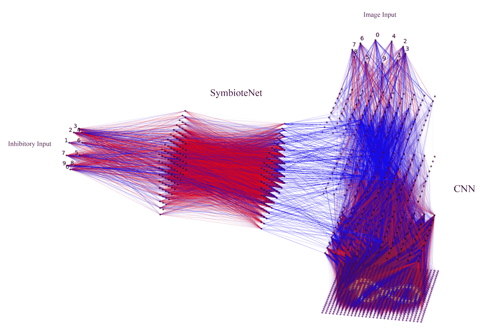

Some of the most important transitional points in the history of science have been moement when we quantized the world. Much like zooming into sub-attomic interractions has brought us nuclear power, zooming into neuronal interractions holds promise in bringing us more capable intelligence.

Mechanistic Interpretability is largely predicated on this notion. Similarly to physics, it takes an axiomatic approach and tries to look into the network's constituents at their quanta.
In todays interpretability research, networks can be studies through two lenses: Human scentric, and machine centric. In this post I propose new approach at uncovering network dynamics through machine centric interpretability.

Just as a neurosurgeon maps brain function by stimulating neural tissue during a craniotomy, I develop a Symbiotic network that can selectively inhibit or stimulate the primary model's weights, revealing its internal circuitry and offering a novel approach to studying and steering artificial neural networks.


<!-- width 750 is the perfect width for the blogs. height should be ~400 -->
<p align="center"></p>
*<center>Image of a Symbiotic network pertubating a primary network</center>*


---

One of the earliest frameworks for Mechanistic universality was proposed by Chris Olah, who outlined three fundamental claims.

Claim 1: Features
Features are the fundamental unit of neural networks. They correspond to directions. These features can be rigorously studied and understood.

Claim 2: Circuits
Features are connected by weights, forming circuits.
These circuits can also be rigorously studied and understood.

Claim 3: Universality
Analogous features and circuits form across models and tasks.

These claims have recently been shown to be largely true[^1], and yet very little applicable work has sipped out of this framework.
As such, this is my tribute to interpretability and uncovering the unknown.  

---

High level purpose of the essay: Demonstrate the importance of analyzing networks through subsideary networks. 

---
---
# TABLE OF CONTENTS:

### OVERVIEW

### MODEL ARCHITECTURE


### 


#### Some PowerShell Code

```powershell
Write-Host "This is a powershell Code block";

# There are many other languages you can use, but the style has to be loaded first

ForEach ($thing in $things) {
    Write-Output "It highlights it using the GitHub style"
}
```


---
References:
[^1]: Olah, C., et al. (2020). ["Zoom In: An Introduction to Circuits."](https://distill.pub/2020/circuits/zoom-in/)