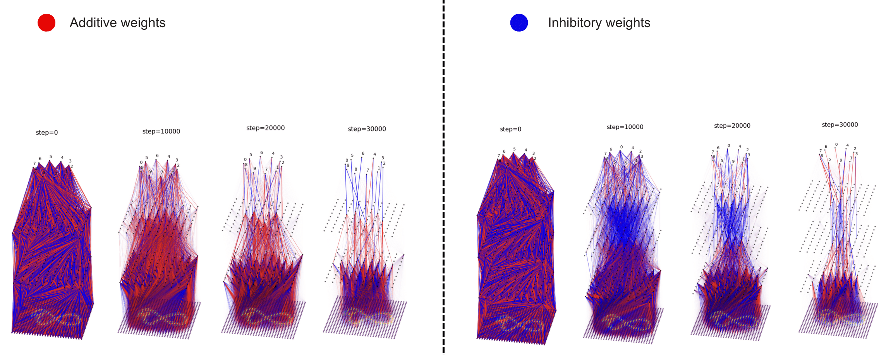

 

  <table>
    <tr>
      <td align="center">
        Gleb Razgar 
        <a href="mailto:gleb.razgar@gmail.com">gleb.razgar@gmail.com</a>
      </td>
      <td align="center">
        Hiroki Kozuki 
        <a href="mailto:hirokozuki@icl.ac.uk">hirokozuki@icl.ac.uk</a>
      </td>
    </tr>
  </table>

<h3 align="center">1. Background </h3>

AIs read our thoughts. Literally. In the context of neuroscience this is ever more so. For people with Brain Computer Interfaces (BCIs), AI doesnt just read their thoughts - it reads their intentions - and soon will be able to control them.

Learning to read and control AIs intentions before AI learns to control ours is a logical goal we should strive to accomplish. But how do we?

Hirerto, interpreting and steering AI's has mainly been done through two key lenses: Mechanistic and Representational. Both deal with different units of analysis. [Representation engineering](https://glebrazgar.github.io/2025/01/10/RepE.html) (RepE) is a top-down study of the network effects exibited by the populations of neurons, whilst Mechanistic Interpretability (MI), is a bottom-up study attempting to reverse engineer those effects from individual neurons and circuits. MI is precise but impractical, RepE is practical but imprecise. If we were to make it practica and precise to controll AI models, both of the techniques are insufficient. To solve this we [Hiro Kozuki](https://www.linkedin.com/in/hiroki-kozuki/) propose network symbiosis as a possible solution. 

<h3 align="center">2. Network Symbiosis </h3>

<h4 style="margin-bottom: 0"><u>2.1 Intuition </u></h4>
To understand network Symbiosis consider brain computer interfaces. Putting neuro-plasticity aside BCIs learn your brain representations that map to a desired output. The idea behind Symbiotic networks is similar. There are always at least two networks involved (Figure 1):  
1. Primary feed-forward network - acting like the brain
2. Symbiote feed-forward network - acting like the BCI

The Primary network is trained to map input to output as per usual, whilst the SymbioteNet uses the Primaries models activations or weights as it's input and tries to manipulate them to get the Primary network to behave in the desired fashion.

<h4 style="margin-bottom: 0"><u>2.2 Example </u></h4>
A simple example would illustrate the concept. Like in Figure1 say we're training a classic MNIST CNN to classify digits 1-10. Once we've trained the Primarty CNN, we would then train a SymbioteNet by feeding in a digit we would like the Primary network to missclassify and backpropagate the error depending on how well it managed to inhibit the digit (by inhibiting all the CNN's neurons apart from the once in the first and last layers). An important detail is that the cross-entropy loss should punish the model for miss-classifying ALL digits, and instead be rewarded if it classifies them all correctly except for the undesired digit. 

<h3 align="center">3. Interpreting Networks </h3>
SymbioteNet's role is to elucidate the low level representations of the Primary network. This implies being able to capture mechanistically universal concepts amongst networks first highlighted by Chris Olah and his team: 

**Claim 1: Features**
Features are the fundamental unit of information of a network. Can SymbioteNet reveal the features of the studied model?

**Claim 2: Circuits**
Features are connected by weights, forming circuits. Can SymbioteNet reveal circuits?

**Claim 3: Universality**
Analogous features and circuits form across models and tasks. Can SymbioteNet reveal those circuits recursively?

These claims have been shown to be true across the networks, even though by causation and with low degrees of success. SymbioteNet tries solving exactly that.

<h3 align="center">4. Experiment </h3>
<h4 style="margin-bottom: 0"><u>4.1 Basics </u></h4>
Before scaling to larger networks like transformers we conducted our experiment on the setup discribed in Section 2. Having trained and frozen the weights of the Primary MNIST CNN, we taught the SymbioteNet to inhibit each digit itteratively without missclassifying the un-stated digit until it's turn.

<h4 style="margin-bottom: 0"><u>4.2 Polysemanticity </u></h4>
Smaller networks have the propensity to learn concepts easily, so, motivated by the BIMT paper, we induce polysemanticity by progressively preuning the waker weights away during training of the Primary network (Figure3). This forces the network to become more parameter efficient and forces concepts to superimpose in a mixed representation.

<h4 style="margin-bottom: 0"><u>4.3 Results </u></h4>
BLa Bla Bla

