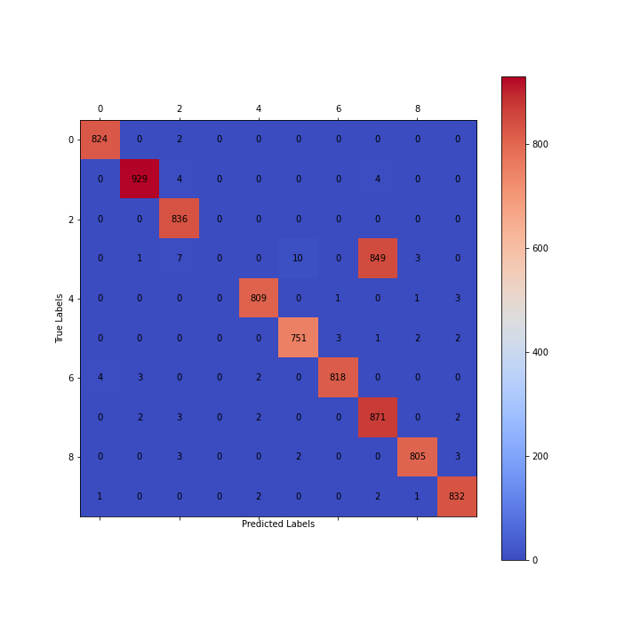

 

  <table>
    <tr>
      <td align="center">
        Gleb Razgar 
        <a href="mailto:gleb.razgar@gmail.com">gleb.razgar@gmail.com</a>
      </td>
    </tr>
  </table>

<h3 align="center">1. MATS 8.0 Submission! </h3>

AIs read our thoughts. Literally. In the context of neuroscience, this is even more so. For people with Brain-Computer Interfaces (BCIs), AI doesn't just read their thoughts - it reads their representations, and can often control them.

Hitherto, Mechanistic Interpretability researchers have been semi-manually inspecting model diffs to find circuits and features, but what if we could more reliably learn from thousands of diffs to elucidate the models circuits? 

For this submission I built SymbioteNet - a model that learns neural circuits of a Primary network through active "diff" generation. By applying and analyzing thousands of weight permutations and their impact on model behavior, SymbioteNet systematically maps the relationship between weights and model capabilities, providing a scalable approach to circuit mapping. 

  
<b>Figure 1:</b> SymbioteNet (left) steering the primary neural network (right) by identifying and inhibiting it's circuits

<h3 align="center">2. Network Symbiosis </h3>

<h4 style="margin-bottom: 0"><u>2.1 Intuition </u></h4>
To understand network Symbiosis, consider brain-computer interfaces. Putting neuroplasticity aside, BCIs effectively learn your brains "diffs", that map to a desired output. The idea behind Symbiotic networks is similar. There are always at least two networks involved (Figure 1):  
1. Primary feed-forward network - acting like the brain
2. Symbiote feed-forward network - acting like the BCI

The Primary network is trained normally on its target task (e.g., classification). SymbioteNet then learns to generate targeted weight modifications ("diffs") to the Primary network. When given an input and a desired intervention (e.g., "inhibit the detection of feature X"), SymbioteNet produces the precise weight changes needed to achieve that intervention while preserving other capabilities of the Primary network.

<h4 style="margin-bottom: 0"><u>2.2 Example </u></h4>
A simple example would illustrate the concept. Like in Figure 1, say we're training a classic MNIST CNN to classify digits 1-10. Once we've trained the Primary CNN, we would then train a SymbioteNet by feeding in a digit we would like the Primary network to misclassify and backpropagate the error depending on how well it managed to inhibit the digit (by inhibiting all the CNN's neurons apart from the ones in the first and last layers). An important detail is that the cross-entropy loss should punish the model for misclassifying ALL digits and instead be rewarded if it classifies them all correctly except for the undesired digit. 

<h3 align="center">3. Interpreting Networks </h3>
SymbioteNet's role is to elucidate the low-level representations of the Primary network. This implies being able to capture mechanistically universal concepts among networks first highlighted by Chris Olah and his team: 

**Claim 1: Features**
Features are the fundamental unit of information of a network. Can SymbioteNet reveal the features of the studied model?

**Claim 2: Circuits**
Features are connected by weights, forming circuits. Can SymbioteNet reveal circuits?

**Claim 3: Universality**
Analogous features and circuits form across models and tasks. Can SymbioteNet reveal those circuits recursively?

These claims have been shown to be true across the networks, even though by causation and with low degrees of success. SymbioteNet tries solving exactly that.

<h3 align="center">4. Experiment </h3>
<h4 style="margin-bottom: 0"><u>4.1 Basics </u></h4>
Before scaling to larger networks like transformers, we conducted our experiment on the setup described in Section 2. Having trained and frozen the weights of the Primary MNIST CNN, we taught the SymbioteNet to inhibit each digit iteratively without misclassifying the unstated digit until its turn.

  
<b>Figure 2:</b> Training and validation loss of SymbioteNet. As can be deduced from the validation loss, it takes the model significantly longer to learn the weight representations than for the CNN to learn classification.

<h4 style="margin-bottom: 0"><u>4.2 Polysemanticity </u></h4>
Smaller networks have the propensity to learn concepts easily, so, motivated by the BIMT paper, we induce polysemanticity by progressively pruning the weaker weights away during training of the Primary network (Figure 3). This forces the network to become more parameter efficient and forces concepts to superimpose in a mixed representation.

  
<b>Figure 3:</b> Enforcement of polysemanticity through BIMT-like weight pruning.

<h4 style="margin-bottom: 0"><u>4.3 Results </u></h4>
After training both networks and freezing their weights, we test them on the unseen dataset by checking how many times SymbioteNet manages to successfully steer the Primary network away from correctly classifying the digit 3.

Importantly, SymbioteNet is made two times smaller than the Primary network, such that it is forced to learn the compressed representation of the subsidiary model's weights rather than simply memorizing the digit activations. That's where the advantage of training SymbioteNet on the CNN's weights rather than activations really shines.

  
<b>Figure 4:</b> Confusion matrix showing SymbioteNet's success in learning the circuits of the Primary network and inhibiting them to correctly misclassify the digit 3 on command.

As seen in the confusion matrix, after training, SymbioteNet managed to prevent the Primary model from classifying 100% of the digits 3 from an equal data distribution. Combined with the loss observations, and equally spreading the model's capacity to inhibit the weights across layers with the exclusion of the first and last, the only reasonable deduction is that SymbioteNet has learned the intrinsic representations of both features and circuits.

<h3 align="center">5. Future Work </h3>
This brief study has just scratched the surface of symbiotic networks. The next steps in the inquiry are rooted in scaling this approach to much larger models, such as transformers, as though our mimicry of polysemanticity is representative of larger networks, transformers encode information in a different dimension of complexity. If successfully scaled to transformers, it's evident that network symbiosis would make for a new way to interpret and steer models. 