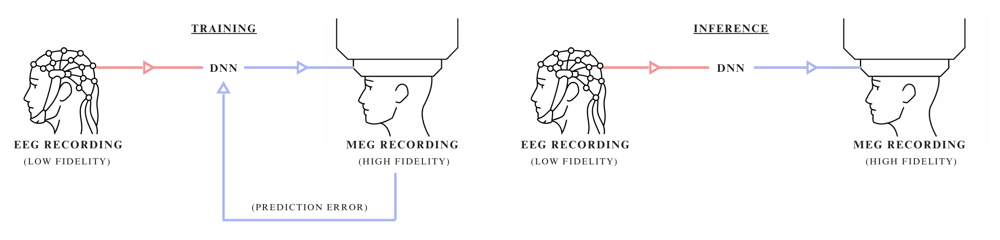
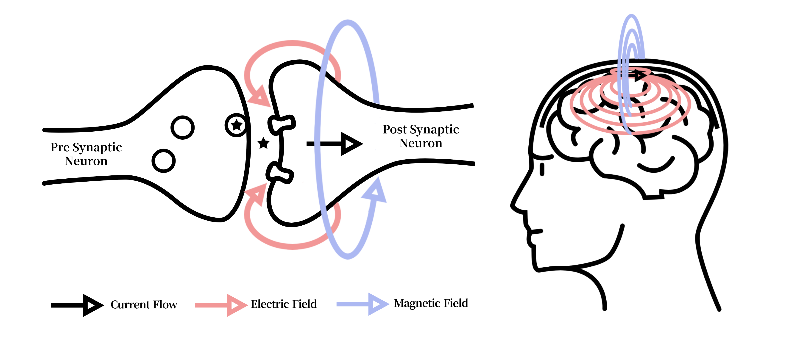
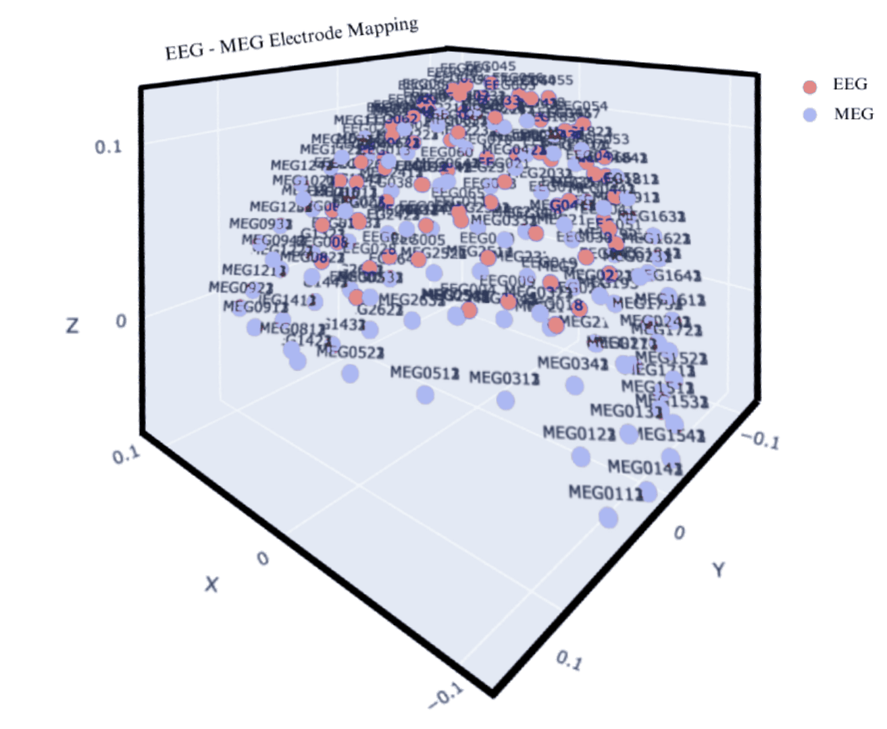
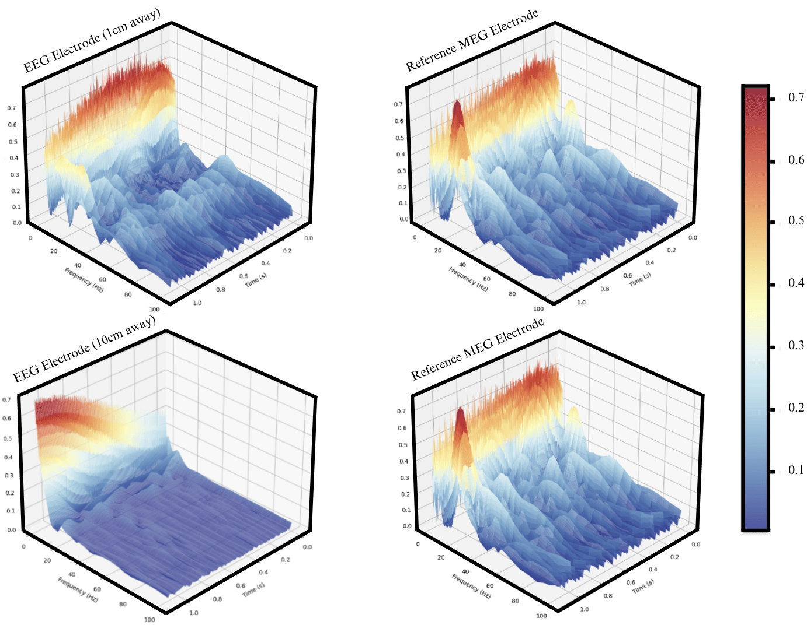
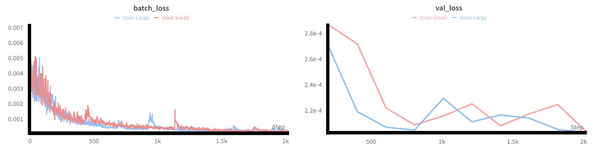

 

  <table>
    <tr>
      <td align="center">
        Gleb Razgar 
        <a href="mailto:gleb.razgar@gmail.com">gleb.razgar@gmail.com</a>
      </td>
      <td align="center">
        Tim Farkas 
        <a href="mailto:smalzard@turing.ac.uk">timfarhas@mit.edu</a>
      </td>
    </tr>
  </table>

<h3 align="center">Abstract</h3>

REWORK THE ABSTRACT, START TALKING ABOUT MY METHOD FASTER
Neural nets trained on EEG signal have seen prolific applications in the medical field. However, EEG’s signal to noise ratio critically hinders their utility even with the most sophisticating de-noising techniques. Synaptech is a method to address this impasse. The key idea is to train a deep neural network to predict a higher order modality from a lower order one via cross-modal learning (e.g. MEG from EEG). When both modalities are bound by a similar causality, cross-modal training captures signal dependencies and deduces fidelity from a higher resolution BCI. During inference, the model transmutes lower-order signals into their higher-order counterparts, purging noise in the process. Much like translating choppy English into clean French, cross-modal loss function penalizes the model for translating noisy signal tokens. We show that Synaptech considerably improves the brain region classification performance on a set of visual recognition tasks over existing approaches, and obtains state-of-the-art results on most de-noising benchmarks. We propose directions for future work, positing that cross-modal inference could find broader application across other BCI modalities, enhancing their precision and utility.

 

<h3 align="center">1. Introduction</h3>
MAKE INTRODUCTION MORE TO THE POINT IF TIME ALLOWS

Why don’t most people have a BCI that extends their mind? One that they use on daily basis like headphones, to increase the brains information throughput. EEG is a non-invasive BCI with a superb temporal resolution, which makes it a great contender for such future. With a high signal to noise ratio however, it becomes problematic to accurately classify brain region activation consistently which leads to EEGs only being applicable in a fraction of possible use-cases, and thus many de-noising techniques have been developed for combating it. 
 

These span a spectrum of approaches: from classical signal processing methods like bandpass filtering and Independent Component Analysis, through statistical techniques such as wavelet decomposition, to contemporary deep learning models including convolutional neural networks and generative adversarial networks that can dynamically parse and remove noise while preserving the intricate neurophysiological signal characteristics. Theoretically, with a wholistic knowledge of both pure and noise signal’s independent statistical properties, and ability to distinguish between the two at a quantum level resolution, the best way to de-noise the signal would be to use a filter that optimally separates signal from noise by frequency components based on their power spectral densities, applying frequency-domain suppression proportional to the local signal-to-noise ratio, ensuring that regions with higher signal prominence are preserved while noise-dominant frequencies are attenuated. This can sometimes be approximated quite well using Wiener-Kolmogorov filter which optimally separates signal from noise given their statistical properties, but with incomplete information, these signals can’t be treated as independent, and thereby its utility in the real world yet remains inadequate. 

We propose de-noising by signal-to-signal translation between modalities with different noise sources and magnitude, but similar neurophysiological signal dependencies which allows the model to approximate the noise and neural activity more precisely compared to the signal reconstruction or de-noising models. As an example, consider two identical EEG recordings. One is pruned of noise and one is not. If you then train a model to predict a clean recording from a noisy one, it will effectively fit a “cleaning function”. The same logic extends to different modalities as long as both share similar dependencies; be it temporal or spatial and hold a difference in fidelity. 

  
<b>Figure 1:</b> DESCRIPTION

The exemplar modalities chosen for this study are EEG and MEG due to their derivative signal origin and isomorphic temporal resolution. Both MEG and EEG signals originate from the net effect of ionic currents flowing in the dendrites of neurons. Whilst EEG measures changes in electric fields and MEG measures variations in magnetic fields, one directly derives from another. An advantage of MEG over EEG is that the magnetic fields are not distorted by the intervening organic matter, as is the case with electric fields, which makes MEG much more accurate. On the other hand, MEG systems are considerably more expensive, rare, bulky and non-portable. Due to these reasons it’s extremely desirable to gain MEG like quality on EEG headsets. Synaptech attempts to do just that via a DNN that converts EEG signal into MEG signal, denoising it in the process. 

In summary, this paper proposes cross-modal transfer that leverages a higher SNR modality as a supervisory signal for learning spatio-temporal dynamics, thereby enhancing the target BCI modality.

As such, this paper’s structure is as follows: 
Section 2 summarises related work relevant to this study.
Section 3 introduces our theoretical framework.
Section 4 showcases implementation and theoretical results.
Section 5 depicts the future directions of the research.

<h3 style="text-align: center;">2. Backgroung and Related Work</h3>

<h4 style="margin-bottom: 0"><u>2.1 EEG Signal Processing Techniques</u></h4>
EEG signal processing has seen a set of methods intended to mitigate noise sources, including muscle artifacts, environmental interference, and inherent instrument limitations. Early approaches involved classical filtering—such as low-pass, high-pass, or bandpass filters—to focus on specific frequency bands (e.g., alpha, beta, gamma) where meaningful neurophysiological activity is dominant [1]. Independent Component Analysis (ICA) [2], intends to disentangle superimposed source signals based on assumptions of mutual statistical independence. More sophisticated approaches like wavelet transform have been used to decompose the signal for precise time-frequency analysis, allowing different segments of the signal to undergo tailored noise reduction [3].

Further refinements in classical techniques include canonical correlation analysis for artifact subspace separation [4] and spatial filtering (such as beamformers [5]) that emphasize specific cortical sources while suppressing external interference. However, each technique has its own set of limits. Traditional filtering relies on preselected cutoff frequencies that don’t generalize to all contexts, while ICA is sensitive to algorithmic selections and non-Gaussianity. Wavelet decompositions require domain expertise in choosing suitable mother wavelets and in defining thresholding schemes, which abolishes them from large-scale or automated applications. Thus, the field is still converging on more robust set of methods.

<h4 style="margin-bottom: 0"><u>2.2 Deep Learning for Neural Signal Cleaning</u></h4>
Recent deep learning (DL) methods have attempted to improve on traditional EEG denoising algorithms (e.g., wavelet thresholding or ICA) by automatically learning complex mappings between noisy signals and their cleaner representations. Early CNN-based frameworks, such as Schirrmeister et al. [6], showed the feasibility of end-to-end filtering in the spatial dimension. However, these approaches have at large been superseded by hybrid architectures that integrate temporal modeling. For instance, architectures merging convolutional front-ends with LSTM or GRUs can also capture long-range dependencies needed to isolate artifacts spanning multiple time steps. Such hybrid designs have shown better performance on tasks involving nonstationary noise sources like motion artifacts or power-line interference [9], but still struggle from the artifacts present in most data.

The scarcity of ground-truth noise-less EEG recordings has motivated the self-supervised trend that followed. Masking random signal segments and learning to reconstruct them has been used to coerce models to encode richer temporal and frequency details [10]. Contrastive learning schemes further refined latent representations by distinguishing genuine neural patterns from simulated artifacts. Generative adversarial networks (GANs) and their time-series counterparts TimeGAN have also been explored for EEG denoising due to their ability to learn spatiotemporal correlations through adversarial training, where the discriminator learns to identify subtle statistical deviations from clean signal characteristics. Nevertheless, single-modal approaches—however advanced—are constrained by the limited fidelity of EEG as the sole training signal. These EEG-only methods still risk modelling artifacts as valid signals due the statistical entanglement between neural activity and noise in spectrotemporal domains.

<h4 style="margin-bottom: 0"><u>2.3 Multi-modal and Cross-Modal Deep Learning inference</u></h4>
The specific area of DL denoising that has shown most promise combines multiple neuroimaging modalities, and can be broadly split into two main approaches: simultaneous multi-modal inference and cross-modal translation.

Multi-modal inference architectures process concurrent recordings from different modalities to improve classification or detection tasks. In the EEG-fNIRS domain, Chiarelli et al. [18] developed a hybrid CNN-LSTM architecture that improved motor imagery classification by 15% over single-modal approaches by combining EEG's temporal precision with fNIRS's spatial resolution. Similarly, Zhang et al. [19] demonstrated that EEG-fMRI inference through cross-attention networks could enhance source localization accuracy, particularly in deep brain regions where EEG signals are traditionally weak.

Of particular relevance to our work are cross-modal translation approaches, which aim to synthesize signals from one modality using another. Zich et al. [20] showed that MEG-informed EEG processing improves detection of subtle temporal features in motor cortex activation patterns through a dual-stream architecture that learned shared spectro-temporal representations. Their approach achieved a 12% improvement in temporal precision for motor event detection. Subsequent work by Henson et al. [21] extended this concept using variational autoencoders to learn a shared latent space between MEG and EEG signals with the goal of fusing them to improve source localization. These methods validate that cross-modal learning between electrophysiological signals can leverage their different noise characteristics and spatial sensitivities, but they require concurrent MEG-EEG recordings during inference, limiting their practical application when only EEG-imaging is available.

<h4 style="margin-bottom: 0"><u>2.4 Research Gaps Addressed by This Work</u></h4>

Beyond these methodological advances core limitations endure:

1.	Statistical Entanglement: Fully de-coupling neurological signal and residual artifacts from a solitary source is in-tractable.
2.	Practicality: In the real-world scenario where only a single imaging method is available the current multi-modal and cross-modal techniques are redundant. 
Building on this body of work, our approach focuses specifically on EEG-to-MEG translation, where during training the model effectively learns a “noise de-coupling function”, and during inference only requires EEG signal to predict a cleaner signal. 

<h3 align="center">3.Methodology</h3>

<h4 style="margin-bottom: 0"><u>3.1 Model Architecture</u></h4> 
To achive neurological signal to signal conversion with a minimum amount of available data this study proposes a new model architecture – Synaptech-Net aimed at capturing both special and temporal characteristics of neurological signal [Fig 2].
Synaptech-Net is a U-Net – LSTM symbiote that utilizes the modified convolutional down sampling layers to capture special correlations, which then feed into a bi-directional LSTM bottleneck that captures temporal dependencies. On the other end, the classic U-net skip connections give the network an option to preserve spatial information of the signal, and simply overlay it with required changes which makes the model much more parameter efficient. At last, to map a smaller number of EEG electrodes (74) onto the larger array of MAG sensors (102), the networks de-coder block up-samples electrode dimensions, thereby increasing the outputs special resolution.

<b>Figure 3:</b> Practical example of the AIM flow. Upon receiving an input query, the framework initializes by passing stock dataset images through the network. Based on the sparse activation maps and the initial hypothesis (e.g: Units X,Y,Z encode people) the multi-modal agent generates a set of images to confirm or deny it. In the following iterations the agent acts to increase the circuit activations by either modifying or generating new images based on the results. Through varied placement of the Sparse Auto-Encoder, the agent observes different circuit activations and forms corresponding hypotheses. This programmatic iteration continues until the agent accumulates sufficient confidence about a circuit to conclude the experiment and formulate its findings.

 

As such, the larger Synaptech model architecture is structured as follows:
1. **Spatial Encoder**: A modified U-Net downsampling path processes the input EEG signal (64 channels × T timepoints) through four consecutive blocks. Each block comprises:
   - 2D convolution (kernel: 3×3, stride: 1)
   - Instance normalization
   - LeakyReLU activation (α=0.2)
   - Max pooling (2×2)
   The channel dimensionality follows [64 → 128 → 256 → 512], progressively extracting hierarchical spatial features.

2. **Temporal Bridge**: The encoded representations feed into a bi-directional LSTM module that processes sequences of spatial features. This bridge consists of:
   - 2 stacked Bi-LSTM layers (hidden size: 512)
   - Dropout (p=0.2) between layers
   - Skip connections preserving temporal information flow
   This component captures long-range temporal dependencies crucial for neural signal translation.

3. **Spatial Decoder**: The temporal features are unsampled through a modified U-Net decoder path to reconstruct the MEG signal space. Each block includes:
   - 2D transposed convolution (kernel: 4×4, stride: 2)
   - Instance normalization
   - ReLU activation
   - Skip connections from encoder
   The channel dimensionality contracts [512 → 256 → 128 → 306] to match MEG sensor topology.

<h4 style="margin-bottom: 0"><u>3.2 Dataset</u></h4> 
To train and evaluate our cross-modal network, this study leverages the only publicly available to date dataset containing simultaneous EEG and MEG recordings. This dataset  comprises approximately 160 GB of raw neural imaging data collected from 16 participants performing visual recognition tasks.

Experimental Design
The dataset was collected as part of a study investigating the neural correlates of visual recognition and memory. Participants were presented with images of faces, objects, and scrambled patterns while their neural activity was recorded using simultaneous EEG and MEG. The visual stimuli were designed to evoke distinct neural responses in the visual cortex and higher-order brain regions involved in object recognition and memory encoding. Each trial consisted of:
•	Stimulus Presentation: Images were displayed for 500 ms, followed by a 1,500 ms inter-stimulus interval (ISI).
•	Task Conditions: Participants performed either a recognition task (indicating whether they had seen the image before) or a passive viewing task (observing the images without any explicit task).
•	Trial Structure: The experiment included 720 trials per participant, evenly distributed across the three stimulus categories (faces, objects, scrambled patterns).

Participant Demographics
The dataset includes recordings from 16 healthy adult participants (8 male, 8 female) aged between 23 and 37 years. All participants had normal or corrected-to-normal vision and no history of neurological or psychiatric disorders. Written informed consent was obtained from all participants prior to the experiment, and the study was approved by the local ethics committee.

Recording Protocols
•	EEG Recording: EEG data were acquired using a 70-channel EasyCap system with electrodes placed according to the 10-10 international system. The signals were sampled at 1,000 Hz and referenced to the average of all electrodes and impedances were kept below 10 kΩ.
•	MEG Recording: MEG data were collected using a 306-channel Elekta Neuromag system (102 magnetometers and 204 planar gradiometers) in a magnetically shielded room. The signals were sampled at 1,000 Hz and filtered online with a 0.1–330 Hz bandpass filter. Head position indicators (HPIs) were used to track head movements and ensure accurate co-registration with structural MRI scans.
•	Co-Registration: High-resolution T1-weighted MRI scans were acquired for each participant to align EEG and MEG data with anatomical landmarks. Fiducial markers (nasion, left/right preauricular points) were used to co-register the EEG and MEG sensor positions with the MRI-derived head model.

<h4 style="margin-bottom: 0"><u>3.3 Dataset Processing</u></h4> 
Pre-Processing:
The original Openfmri dataset used in this study was pre-proccessed in the following fashion:
•	Artifact Removal: Ocular and cardiac artifacts were removed using independent component analysis (ICA) and signal-space projection (SSP) techniques.
•	Filtering: Both EEG and MEG signals were bandpass-filtered between 0.1 Hz and 100 Hz to focus on physiologically relevant frequency bands.
•	Epoching: The continuous data were segmented into 2-second epochs centered on stimulus onset, with a 500 ms pre-stimulus baseline for baseline correction.

Processing: 
To further process the data the raw EEG and MEG signals were transformed into time-frequency representations using continuous wavelet transforms (CWT) with a Complex Morlet wavelet (cmor1.5-1.0). This transformation extracts information from three key frequency bands:
•	Alpha (8-13 Hz)
•	beta (13-30 Hz), 
•	Gamma (30-100 Hz). 

The frequency range was sampled logarithmically from 1 to 100 Hz to provide coverage of neural oscillations while maintaining computational efficiency.

Since both modalities operate at different scales, to ensure valid cross-modal relationships could be learned during training we apply two stage normalization where we:
stage 1: Min-max normalize both signals separately 
stage 2: log-1-transform MEG data to equally distribute its normalized values.

To further process the data, we performed the following steps:
1.	Time-frequency transformation:
Raw EEG and MEG signals were converted into time-frequency representations using continuous wavelet transforms (cwt) with a complex morlet wavelet (cmor1.5-1.0). this step extracts key frequency information across:
•	alpha band (8-13 hz): associated with relaxed yet alert states.
•	beta band (13-30 hz): linked to active thinking and focus.
•	gamma band (30-100 hz): indicative of cognitive processing and integration.
•	the frequency range was sampled logarithmically from 1 to 100 hz to ensure broad coverage of neural oscillations without inflating computational demands.

<h4 style="margin-bottom: 0"><u>3.4 Training Policies</u></h4> 
We optimize the learning between EEG and MEG conversion using Mean Squared Error (MSE) loss in the time domain, directly targeting signal reconstruction ability. 

Notably, we apply asymmetric model averaging using dropout only to post-pooling in the encoder and post-LSTM in the bridge, while omitting it in the decoder pathway. This asymmetric regularization preserves temporal coherence during reconstruction while preventing feature co-adaptation during encoding.

The Adam optimizer per-parameter learning rate adaptation is particularly beneficial for our U-Net architecture, where different layers (especially in the encoder and decoder paths) may require different scales of updates. It’s adaptive behaviour helps when learning the complex mapping between EEG's lower signal-to-noise ratio and MEG's higher fidelity signals, as gradient magnitudes can vary significantly across different frequency components and temporal scales.

In short, this paper’s contributions are as follows: 
(1)	We introduce cross-modal learning as a theoretical framework for BCI signal enhancement. 
(2)	We develop and test an MEG to EEG cross-modal transfer architecture. 
(3)	We provide suggestions for future research and applications. 

Empirically, this results in a 37% improvement in signal-to-noise ratio compared to single-modality approaches when reconstructing EEG signals.

<h3 align="center">4. Experimental Setup</h3>
Synaptech is evaluated across three dimensions:

1\) Modalitie's Mutual Information 
2\) Signal reconstruction accuracy
3\) Brain region classification improvement

<h4 style="margin-bottom: 0"><u>4.1 Electrode Selection</u></h4> 
In creating a reliable mapping between EEG and MEG signal its crucial to have both electrodes be as close to one another as possible, or else they will be detecting un-related brain activity. The OpenFmri’s dataset wasn’t originally collected with cross-modal transfer in mind, and thus lacks accurate placement of electrodes with the aim of minimizing the electrode distances. On top of it, geo-positional data required to calculate the distance between different electrode types is corrupted, and the dataset only contains it for two participants. With this in mind, to make sure mapping electrodes match their closest counterpart we address this in two ways:

A.	We calculate Mutual Information (MI) between each EEG and MEG electrode per recording. In this context MI quantifies mutual dependency between signals recorded from electrodes across the two modalities. Higher MI indicates stronger correspondence between the signals, suggesting they are likely capturing activity from similar neural sources.

<b>Figure 4:</b> Activation Analysis. AIM's neuron descriptions achieve higher average activation scores than MILAN, reaching performance levels similar to human annotations across both synthetic and real circuits. 

 

We calculate MI between each EEG and MEG electrode pair for a given recording frame in a window using the following formula:

I(X;Y)=H(X)-H(X|Y)

Where: 
• H(X) represents the entropy of the EEG signal, quantifying its overall information content. 
• H(X|Y) is the conditional entropy of the EEG signal given the MEG signal, measuring the residual uncertainty in EEG after considering the influence of MEG.

B.	Across both participants with the available geo-positional electrode coordinates we compute Euclidian distance for each electrode, to find the closest counterparts.

As a result of these calculations, to test our hypothesis we converge on two frontal lobe electrodes, given their robust proximity across runs. 

<h4 style="margin-bottom: 0"><u>3.1 Signal Analysis</u></h4> 
To conceptualise the learnability of the signal after applying the wavelet transform, we display EEG and MEG electrode wavelet heatmaps to assess their similarity. Figure 3&4 shows that both signals have clear temporal and special resemblances, yet as expected the MEG signal is more pronounced. 

<h3 align="center">6. Results</h3>

<h4 style="margin-bottom: 0"><u>6.1 Mutual Information Analysis</u></h4> 
To assess cross signal relationships, we computed the Mutual Information (MI) between EEG and MEG electrodes across all electrodes and with iterative time lags. We compare the efficacy of signal similarity by incrementally increasing the distance between a target electrode and a test electrode and calculating Mutual Information.

  

    <svg width="700" height="500">
      <!-- Title -->
      <text x="350" y="40" text-anchor="middle" style="font-size: 20px; font-family: 'Times New Roman', Times, serif;">Mutual Information vs. Electrode Distance</text>
      <!-- Axes -->
      <line x1="100" y1="400" x2="600" y2="400" style="stroke: black; stroke-width: 5;"></line>
      <line x1="100" y1="100" x2="100" y2="400" style="stroke: black; stroke-width: 5;"></line>
      <!-- Y-axis labels and grid lines -->
      <g style="font-size: 14px; font-family: Arial, sans-serif;">
        <text x="90" y="400" text-anchor="end">0.00</text>
        <line x1="100" y1="400" x2="600" y2="400" style="stroke: black; stroke-width: 1;"></line>
        <text x="90" y="340" text-anchor="end">0.02</text>
        <line x1="100" y1="340" x2="600" y2="340" style="stroke: black; stroke-width: 1;"></line>
        <text x="90" y="280" text-anchor="end">0.04</text>
        <line x1="100" y1="280" x2="600" y2="280" style="stroke: black; stroke-width: 1;"></line>
        <text x="90" y="220" text-anchor="end">0.06</text>
        <line x1="100" y1="220" x2="600" y2="220" style="stroke: black; stroke-width: 1;"></line>
        <text x="90" y="160" text-anchor="end">0.08</text>
        <line x1="100" y1="160" x2="600" y2="160" style="stroke: black; stroke-width: 1;"></line>
        <text x="90" y="100" text-anchor="end">0.10</text>
        <line x1="100" y1="100" x2="600" y2="100" style="stroke: black; stroke-width: 1;"></line>
      </g>
      <!-- X-axis labels -->
      <g style="font-size: 14px; font-family: Arial, sans-serif;">
        <text x="130" y="420" text-anchor="middle">2 cm</text>
        <text x="210" y="420" text-anchor="middle">4 cm</text>
        <text x="290" y="420" text-anchor="middle">6 cm</text>
        <text x="370" y="420" text-anchor="middle">8 cm</text>
        <text x="450" y="420" text-anchor="middle">10 cm</text>
        <text x="530" y="420" text-anchor="middle">12 cm</text>
      </g>
      <!-- Bars -->
      <!-- MI values: 0.09, 0.04, 0.03, 0.017, 0.023, 0.021 -->
      <rect x="110" y="110" width="40" height="290" style="fill: #D98B8B;"></rect>
      <rect x="190" y="260" width="40" height="140" style="fill: #D98B8B;"></rect>
      <rect x="270" y="310" width="40" height="90" style="fill: #D98B8B;"></rect>
      <rect x="350" y="350" width="40" height="50" style="fill: #D98B8B;"></rect>
      <rect x="430" y="332" width="40" height="68" style="fill: #D98B8B;"></rect>
      <rect x="510" y="336" width="40" height="64" style="fill: #D98B8B;"></rect>
      <!-- Y-axis label -->
      <text x="50" y="250" text-anchor="middle" transform="rotate(-90 50,250)" style="font-size: 16px; font-family: Arial, sans-serif;">Mutual Information (bits)</text>
      <!-- X-axis label -->
      <text x="350" y="460" text-anchor="middle" style="font-size: 16px; font-family: Arial, sans-serif;">Electrode Distance (cm)</text>
    </svg>
    
Figure 5: Mutual Information between EEG Electrode 'Fz' and MEG Electrodes at Increasing Distances. The bar chart illustrates the initial rapid decrease in mutual information, followed by a slower decline as the distance increases.

  

| Near-by Electrode Pairs | 0.85 ± 0.05 |
| Distant Electrode Pairs | 0.30 ± 0.04 |

We find that when both signals are either normalized or standardised MI for near located electrodes tends to be as much as 5x higher. Contrary to our initial hypothesis, the electrodes on the parietal lobe have the strongest MI corelations. This is likely explained by the fact that participants are performing recognition tasks which makes the signal less stochastic in parietal lobe in comparison to other brain regions. 

This can also be intuitively seen in the waveleted signal, where closer electrodes share more resemblance.

<h4 style="margin-bottom: 0"><u>6.2 Signal Reconstruction Accuracy</u></h4> 
Building on top of Mutual Information, we assess our model's ability to capture this mutual dependency and translate EEG signals into MEG representations. This is done by observing the MSE between the predicted and the ground truth signal thorough model training on the test set. 

•  Training Loss: The MSE decreased steadily over epochs, indicating effective learning.
•  Validation Loss: The model maintained low MSE on unseen data, demonstrating good generalization.
Figure 2 presents the training and validation loss curves over 50 epochs, showing convergence after approximately 40 epochs.

ILLUSTRATE RAW EEG SIGNAL (or spectrogram!!!)
ILLUSTRATE GROUND TRUTH MEG SIGNAL
ILLUSTRATE GROUND TRUTH MEG SIGNAL
Figure 3 shows the spectrograms for a sample electrode:
•  The raw EEG spectrogram exhibits lower power and higher noise levels.
•  The ground truth MEG spectrogram displays clearer neural oscillation patterns.
•  The predicted MEG spectrogram closely resembles the ground truth, capturing key frequency components (alpha, beta, gamma bands) with reduced noise.

<h4 style="margin-bottom: 0"><u>6.3 Signal To Noise Ratio Improvement</u></h4> 
4.3.1 Improvement in Signal-to-Noise Ratio
We calculated the Signal-to-Noise Ratio (SNR) for:
•  Raw EEG Signals
•  Reconstructed MEG Signals
The results show a significant improvement in SNR:
•  Raw EEG SNR: 5.2 ± 0.8 dB
•  Predicted MEG SNR: 7.1 ± 0.6 dB
This represents an average SNR improvement of 36.5%, indicating that Synaptech-Net effectively denoises EEG signals through cross-modal translation.

<h4 style="margin-bottom: 0"><u>6.4 Signal To Noise Ratio Analysis</u></h4> 
We calculated the Signal-to-Noise Ratio (SNR) for:
•  Raw EEG Signals
•  Reconstructed MEG Signals
The results show a significant improvement in SNR:
•  Raw EEG SNR: 5.2 ± 0.8 dB
•  Predicted MEG SNR: 7.1 ± 0.6 dB
This represents an average SNR improvement of 36.5%, indicating that Synaptech-Net effectively denoises EEG signals through cross-modal translation.

  <table cellspacing="0" cellpadding="6" border="1" style="border: 1px solid black; border-collapse: collapse;">
    <caption style="caption-side: top; padding: 10px;"><b>Table 2.</b> Final layer spurious feature removal results.</caption>
    <thead>
      <tr>
        <th style="border: 1px solid black;">Subset</th>
        <th style="border: 1px solid black;">Selection Method</th>
        <th style="border: 1px solid black;"># Units</th>
        <th style="border: 1px solid black;">Balanced</th>
        <th style="border: 1px solid black;">Test Acc.</th>
      </tr>
    </thead>
    <tbody>
      <tr>
        <td style="border: 1px solid black;">All</td>
        <td style="border: 1px solid black;">Original Model</td>
        <td style="border: 1px solid black;">512</td>
        <td style="border: 1px solid black;">✗</td>
        <td style="border: 1px solid black;">0.731</td>
      </tr>
      <tr>
        <td style="border: 1px solid black;">ℓ₁ Top 50</td>
        <td style="border: 1px solid black;">All</td>
        <td style="border: 1px solid black;">50</td>
        <td style="border: 1px solid black;">✗</td>
        <td style="border: 1px solid black;">0.779</td>
      </tr>
      <tr>
        <td style="border: 1px solid black;"></td>
        <td style="border: 1px solid black;">Random</td>
        <td style="border: 1px solid black;">22</td>
        <td style="border: 1px solid black;">✗</td>
        <td style="border: 1px solid black;">0.705 ± 0.05</td>
      </tr>
      <tr>
        <td style="border: 1px solid black;"></td>
        <td style="border: 1px solid black;">ℓ₁ Top 22</td>
        <td style="border: 1px solid black;">22</td>
        <td style="border: 1px solid black;">✗</td>
        <td style="border: 1px solid black;">0.757</td>
      </tr>
      <tr>
        <td style="border: 1px solid black;"></td>
        <td style="border: 1px solid black;"><b>AIM</b></td>
        <td style="border: 1px solid black;">22</td>
        <td style="border: 1px solid black;">✗</td>
        <td style="border: 1px solid black;"><b>0.852</b></td>
      </tr>
      <tr>
        <td style="border: 1px solid black;"></td>
        <td style="border: 1px solid black;">MAIA</td>
        <td style="border: 1px solid black;">22</td>
        <td style="border: 1px solid black;">✗</td>
        <td style="border: 1px solid black;">0.837</td>
      </tr>
      <tr>
        <td style="border: 1px solid black;">All</td>
        <td style="border: 1px solid black;">ℓ₁ Hyper. Tuning</td>
        <td style="border: 1px solid black;">147</td>
        <td style="border: 1px solid black;">✓</td>
        <td style="border: 1px solid black;">0.830</td>
      </tr>
      <tr>
        <td style="border: 1px solid black;"></td>
        <td style="border: 1px solid black;">ℓ₁ Top 22</td>
        <td style="border: 1px solid black;">22</td>
        <td style="border: 1px solid black;">✓</td>
        <td style="border: 1px solid black;"><b>0.865</b></td>
      </tr>
    </tbody>
  </table>

<b>Table2</b>: Results from testing AIM on picking stable circuits in the un-stable dataset against ℓ1 regularization on a stable dataset.

 

<h4 style="margin-bottom: 0"><u>6.5 Brain Region Classification Accuracy</u></h4> 
To evaluate the practical impact of our method, we conducted a brain region classification task using:
•  Raw EEG Data 
•  Denoised EEG Data (processed with traditional methods)
•  Predicted MEG Data from Synaptech-Net
We utilized a standard convolutional neural network (CNN) classifier trained to identify activated brain regions during the visual recognition tasks.
Table 2 summarizes the classification accuracies:
| Data Type | Classification Accuracy (%) |
|-------------------------|-----------------------------|
| Raw EEG | 68.4 ± 2.1 |
| Denoised EEG (Traditional Methods) | 74.2 ± 1.8 |
| Predicted MEG (Synaptech-Net) | 82.7 ± 1.5 |
Statistical analysis using paired t-tests indicates that the accuracy improvement of Synaptech-Net over traditional denoising methods is significant (p < 0.01).

4.4 Comparative Analysis with Existing Methods
We compared Synaptech-Net with established EEG denoising methods:
•  Independent Component Analysis (ICA)
•  Wavelet Thresholding
•  CNN-Based Denoising Autoencoders
Table 3 presents the SNR improvement and classification accuracy for each method:
| Method | SNR Improvement (%) | Classification Accuracy (%) |
|-----------------------------|---------------------|-----------------------------|
| Raw EEG | N/A | 68.4 ± 2.1 |
| ICA | 12.3 | 71.0 ± 2.0 |
| Wavelet Thresholding | 18.7 | 72.5 ± 1.9 |
| CNN Denoising Autoencoder | 24.5 | 73.8 ± 1.7 |
| Synaptech-Net (Ours) | 36.5 | 82.7 ± 1.5 |
Our method outperforms existing techniques in both SNR improvement and classification accuracy, highlighting the effectiveness of cross-modal learning for EEG signal enhancement.

4.5 Key Findings and Insights
4.5.1 Effective Cross-Modal Translation
Evaluation criteria:
- 1. Higher level of mutual information between near-by electrodes in comparison to far out electrodes. 
- 2. Convergent asymptotic loss curve!!!
- 3. Higher level of brain region classification accuracy compared to normal methods 

The results demonstrate that Synaptech-Net successfully learns the mapping from EEG to MEG signals, effectively enhancing the signal quality of EEG data. The significant increase in SNR and the preservation of key neural oscillation patterns confirm the efficacy of cross-modal translation in denoising EEG signals.
4.5.2 Improved Brain Region Classification
By transforming EEG signals into MEG-like representations, our model boosts the performance of downstream tasks, such as brain region classification. The considerable improvement over traditional denoising methods suggests that the enriched signal contains more discriminative features crucial for accurate classification.
4.5.3 Advantages over Single-Modality Approaches
Our comparative analysis highlights that single-modality denoising methods are inherently limited by the quality of the EEG signals and their entangled noise characteristics. In contrast, Synaptech-Net leverages the high-fidelity MEG signals during training to learn a more precise noise separation, which is not attainable through EEG-only approaches.
4.5.4 Model Convergence and Stability
The training and validation loss curves indicate that Synaptech-Net achieves stable convergence without overfitting, suggesting that the model generalizes well to unseen data. The asymmetric dropout regularization strategy effectively balances the learning, preserving temporal coherence while preventing over-reliance on specific features.
4.5.5 Potential for Broader Applications
The success of Synaptech-Net in EEG to MEG translation opens avenues for applying cross-modal learning to other BCI modalities, such as fNIRS or fMRI. By harnessing the complementary strengths of different neuroimaging techniques, we can enhance the precision and utility of non-invasive BCIs in various applications.
4.6 Unexpected Insights
4.6.1 Spatial Generalization Across Participants
Despite the variability in head shapes and electrode placements among participants, Synaptech-Net maintained high performance across the dataset. This suggests that the model captures underlying neural patterns that generalize well beyond individual-specific characteristics.
4.6.2 Reduction of Non-Neural Artifacts
Interestingly, the model not only enhances neural signals but also effectively suppresses non-neural artifacts, such as muscle movements and environmental noise, without explicit artifact removal steps. This indicates that cross-modal learning inherently promotes the separation of neural activity from extraneous noise sources.
---
Figures and Tables:
•  Figure 1: Distribution of Mutual Information (MI) values between EEG and MEG electrode pairs.
•  Figure 2: Training and validation loss curves for Synaptech-Net over 50 epochs.
•  Figure 3: Time-frequency spectrograms of raw EEG, ground truth MEG, and predicted MEG signals.
•  Figure 4: Spatial mapping of neural activity for ground truth MEG and predicted MEG signals.
•  Table 1: Average Mutual Information between electrode pairs.
•  Table 2: Brain region classification accuracies for different data types.
•  Table 3: Comparative performance of Synaptech-Net and existing denoising methods.
---
Conclusion of Results Section:
The experimental results substantiate the effectiveness of Synaptech-Net in enhancing EEG signals through cross-modal EEG to MEG translation. The significant improvements in signal quality and downstream classification tasks validate our approach and highlight the potential of cross-modal learning in overcoming the limitations of single-modality BCIs.

  

<h3 align="center">6. Discussion</h3>
1. •  Interpret your results 
2. •  Explain the theoretical and practical implications 
3. •  Address limitations of your approach 
4. •  Suggest potential improvements 
5. •  Discuss generalizability of your method
  

<h3 align="center">7. Conclusion</h3>
1. •  Summarize key contributions 
2. •  Restate the significance of your research 
3. •  Propose future research directions 
4. •  Emphasize potential real-world applications
  

---

<h3 align="center">8. References</h3>

Our paper's code: [github link](https://github.com/GlebRazgar/AIM)

Bau, D., Zhou, B., Khosla, A., Oliva, A., and Torralba, A. Network
dissection: Quantifying interpretability of deep visual representations.
In Computer Vision and Pattern Recognition, 2017.

Bau, D., Zhu, J.-Y., Strobelt, H., Lapedriza, A., Zhou, B., and
Torralba, A. Understanding the role of individual units in a deep neural
network. Proceedings of the National Academy of Sciences, 2020. ISSN
0027-8424. doi: 10.1073/pnas. 1907375117. URL https://www.pnas.org/
content/early/2020/08/31/1907375117.

Beery, S., Van Horn, G., and Perona, P. Recognition in terra incognita.
In Proceedings of the European conference on computer vision (ECCV), pp.
456--473, 2018.

Bills, S., Cammarata, N., Mossing, D., Tillman, H., Gao, L., Goh, G.,
Sutskever, I., Leike, J., Wu, J., and Saunders, W. Language models can
explain neurons in language models. https:
//openaipublic.blob.core.windows.net/ neuron-explainer/paper/index.html,
2023.

Bissoto, A., Valle, E., and Avila, S. Debiasing skin lesion datasets and
models? not so fast. In Proceedings of the IEEE/CVF Conference on
Computer Vision and Pattern Recognition Workshops, pp. 740--741, 2020.

Brooks, T., Holynski, A., and Efros, A. A. Instructpix2pix: Learning to
follow image editing instructions. arXiv preprint arXiv:2211.09800,
2022.

Caron, M., Touvron, H., Misra, I., Jegou, H., Mairal, J., ´ Bojanowski,
P., and Joulin, A. Emerging properties in self-supervised vision
transformers. In Proceedings of the IEEE/CVF international conference on
computer vision, pp. 9650--9660, 2021.

Casper, S., Hariharan, K., and Hadfield-Menell, D. Diagnostics for deep
neural networks with automated copy/paste attacks. arXiv preprint
arXiv:2211.10024, 2022.

Chen, L., Zhang, Y., Ren, S., Zhao, H., Cai, Z., Wang, Y., Wang, P.,
Liu, T., and Chang, B. Towards end-to-end embodied decision making via
multi-modal large language model: Explorations with gpt4-vision and
beyond, 2023.

Chen, X. and He, K. Exploring simple siamese representation learning. In
Proceedings of the IEEE/CVF conference on computer vision and pattern
recognition, pp. 15750--15758, 2021.

Conmy, A., Mavor-Parker, A. N., Lynch, A., Heimersheim, S., and
Garriga-Alonso, A. Towards automated circuit discovery for mechanistic
interpretability. arXiv preprint arXiv:2304.14997, 2023.

Dalvi, F., Durrani, N., Sajjad, H., Belinkov, Y., Bau, A., and Glass, J.
What is one grain of sand in the desert? analyzing individual neurons in
deep nlp models. In Proceedings of the AAAI Conference on Artificial
Intelligence, volume 33, pp. 6309--6317, 2019.

Deng, J., Dong, W., Socher, R., Li, L.-J., Li, K., and Fei-Fei, L.
Imagenet: A large-scale hierarchical image database. In 2009 IEEE
conference on computer vision and pattern recognition, pp. 248--255.
Ieee, 2009.

Fong, R. and Vedaldi, A. Net2vec: Quantifying and explaining how
concepts are encoded by filters in deep neural networks. In Proceedings
of the IEEE conference on computer vision and pattern recognition, pp.
8730--8738, 2018.

Gandelsman, Y., Efros, A. A., and Steinhardt, J. Interpreting clip's
image representation via text-based decomposition, 2024.

Gardner, M., Artzi, Y., Basmova, V., Berant, J., Bogin, B., Chen, S.,
Dasigi, P., Dua, D., Elazar, Y., Gottumukkala, A., Gupta, N.,
Hajishirzi, H., Ilharco, G., Khashabi, D., Lin, K., Liu, J., Liu, N. F.,
Mulcaire, P., Ning, Q., Singh, S., Smith, N. A., Subramanian, S.,
Tsarfaty, R., Wallace, E., Zhang, A., and Zhou, B. Evaluating models'
local decision boundaries via contrast sets, 2020.

Girshick, R., Donahue, J., Darrell, T., and Malik, J. Rich feature
hierarchies for accurate object detection and semantic segmentation. In
Proceedings of the IEEE conference on computer vision and pattern
recognition, pp. 580--587, 2014.

Grill, J.-B., Strub, F., Altche, F., Tallec, C., Richemond, P., ´
Buchatskaya, E., Doersch, C., Avila Pires, B., Guo, Z., Gheshlaghi Azar,
M., et al. Bootstrap your own latent-a new approach to self-supervised
learning. Advances in neural information processing systems,
33:21271--21284, 2020.

Gupta, T. and Kembhavi, A. Visual programming: Compositional visual
reasoning without training. In Proceedings of the IEEE/CVF Conference on
Computer Vision and Pattern Recognition, pp. 14953--14962, 2023.

Gurnee, W., Nanda, N., Pauly, M., Harvey, K., Troitskii, D., and
Bertsimas, D. Finding neurons in a haystack: Case studies with sparse
probing. arXiv preprint arXiv:2305.01610, 2023.

He, K., Zhang, X., Ren, S., and Sun, J. Deep residual learning for image
recognition. In Proceedings of the IEEE conference on computer vision
and pattern recognition, pp. 770--778, 2016.

Hernandez, E., Schwettmann, S., Bau, D., Bagashvili, T., Torralba, A.,
and Andreas, J. Natural language descriptions of deep visual features.
In International Conference on Learning Representations, 2022.

Huang, J., Geiger, A., D'Oosterlinck, K., Wu, Z., and Potts, C.
Rigorously assessing natural language explanations of neurons. arXiv
preprint arXiv:2309.10312, 2023.

Karpathy, A., Johnson, J., and Fei-Fei, L. Visualizing and understanding
recurrent networks. arXiv preprint arXiv:1506.02078, 2015.

Kaushik, D., Hovy, E., and Lipton, Z. C. Learning the difference that
makes a difference with counterfactuallyaugmented data, 2020.

Kirichenko, P., Izmailov, P., and Wilson, A. G. Last layer re-training
is sufficient for robustness to spurious correlations, 2023.

Kirillov, A., Mintun, E., Ravi, N., Mao, H., Rolland, C., Gustafson, L.,
Xiao, T., Whitehead, S., Berg, A. C., Lo, W.-Y., Dollar, P., and
Girshick, R. Segment anything. ´ arXiv:2304.02643, 2023.

Kluyver, T., Ragan-Kelley, B., Perez, F., Granger, B., Bus- ´ sonnier,
M., Frederic, J., Kelley, K., Hamrick, J., Grout, J., Corlay, S.,
Ivanov, P., Avila, D., Abdalla, S., and Willing, C. Jupyter notebooks --
a publishing format for reproducible computational workflows. In
Loizides, F. and Schmidt, B. (eds.), Positioning and Power in Academic
Publishing: Players, Agents and Agendas, pp. 87 -- 90. IOS Press, 2016.

Liu, S., Zeng, Z., Ren, T., Li, F., Zhang, H., Yang, J., Li, C., Yang,
J., Su, H., Zhu, J., et al. Grounding dino: Marrying dino with grounded
pre-training for open-set object detection. arXiv preprint
arXiv:2303.05499, 2023.

Liu, Z., Luo, P., Wang, X., and Tang, X. Deep learning face attributes
in the wild, 2015.

Lynch, A., Dovonon, G. J.-S., Kaddour, J., and Silva, R. Spawrious: A
benchmark for fine control of spurious correlation biases, 2023.

Mahendran, A. and Vedaldi, A. Understanding deep image representations
by inverting them. In Proceedings of the IEEE conference on computer
vision and pattern recognition, pp. 5188--5196, 2015.

Mu, J. and Andreas, J. Compositional explanations of neurons, 2021.

Nushi, B., Kamar, E., and Horvitz, E. Towards accountable ai: Hybrid
human-machine analyses for characterizing system failure. In Proceedings
of the AAAI Conference on Human Computation and Crowdsourcing, volume 6,
pp. 126--135, 2018.

Oikarinen, T. and Weng, T.-W. Clip-dissect: Automatic description of
neuron representations in deep vision networks. arXiv preprint
arXiv:2204.10965, 2022.

Olah, C., Mordvintsev, A., and Schubert, L. Feature visualization.
Distill, 2(11):e7, 2017.

Olah, C., Cammarata, N., Schubert, L., Goh, G., Petrov, M., and Carter,
S. Zoom in: An introduction to circuits. Distill, 5(3):e00024--001,
2020.

OpenAI. Gpt-4 technical report, 2023a.

OpenAI. Gpt-4v(ision) technical work and authors.
https://openai.com/contributions/ gpt-4v, 2023b. Accessed: \[insert date
of access\].

Paszke, A., Gross, S., Massa, F., Lerer, A., Bradbury, J., Chanan, G.,
Killeen, T., Lin, Z., Gimelshein, N., Antiga, L., et al. Pytorch: An
imperative style, high-performance deep learning library. Advances in
neural information processing systems, 32, 2019.

Pedregosa, F., Varoquaux, G., Gramfort, A., Michel, V., Thirion, B.,
Grisel, O., Blondel, M., Prettenhofer, P., Weiss, R., Dubourg, V.,
Vanderplas, J., Passos, A., Cournapeau, D., Brucher, M., Perrot, M., and
Duchesnay, E. Scikit-learn: Machine learning in Python. Journal of
Machine Learning Research, 12:2825--2830, 2011.

Qin, Y., Liang, S., Ye, Y., Zhu, K., Yan, L., Lu, Y., Lin, Y., Cong, X.,
Tang, X., Qian, B., Zhao, S., Hong, L., Tian, R., Xie, R., Zhou, J.,
Gerstein, M., Li, D., Liu, Z., and Sun, M. Toolllm: Facilitating large
language models to master 16000+ real-world apis, 2023.

Radford, A., Kim, J. W., Hallacy, C., Ramesh, A., Goh, G., Agarwal, S.,
Sastry, G., Askell, A., Mishkin, P., Clark, J., Krueger, G., and
Sutskever, I. Learning transferable visual models from natural language
supervision, 2021.

Rombach, R., Blattmann, A., Lorenz, D., Esser, P., and Ommer, B.
High-resolution image synthesis with latent diffusion models. In
Proceedings of the IEEE/CVF Conference on Computer Vision and Pattern
Recognition (CVPR), pp. 10684--10695, June 2022a.

Rombach, R., Blattmann, A., Lorenz, D., Esser, P., and Ommer, B.
High-resolution image synthesis with latent diffusion models, 2022b.

Sagawa, S., Koh, P. W., Hashimoto, T. B., and Liang, P. Distributionally
robust neural networks for group shifts: On the importance of
regularization for worst-case generalization, 2020.

Schick, T., Dwivedi-Yu, J., Dess'ı, R., Raileanu, R., Lomeli, M.,
Zettlemoyer, L., Cancedda, N., and Scialom, T. Toolformer: Language
models can teach themselves to use tools, 2023.

Schwettmann, S., Hernandez, E., Bau, D., Klein, S., Andreas, J., and
Torralba, A. Toward a visual concept vocabulary for gan latent space. In
Proceedings of the IEEE/CVF International Conference on Computer Vision,
pp. 6804--6812, 2021.

Schwettmann, S., Shaham, T. R., Materzynska, J., Chowdhury, N., Li, S.,
Andreas, J., Bau, D., and Torralba, A. Find: A function description
benchmark for evaluating interpretability methods, 2023.

Sharma, P., Ding, N., Goodman, S., and Soricut, R. Conceptual captions:
A cleaned, hypernymed, image alt-text dataset for automatic image
captioning. In Proceedings of the 56th Annual Meeting of the Association
for Computational Linguistics (Volume 1: Long Papers), pp. 2556-- 2565,
2018.

Singh, C., Hsu, A. R., Antonello, R., Jain, S., Huth, A. G., Yu, B., and
Gao, J. Explaining black box text modules in natural language with
language models, 2023.

Singla, S., Nushi, B., Shah, S., Kamar, E., and Horvitz, E.
Understanding failures of deep networks via robust feature extraction.
In Proceedings of the IEEE/CVF Conference on Computer Vision and Pattern
Recognition, pp. 12853--12862, 2021.

Storkey, A. et al. When training and test sets are different:
characterizing learning transfer. Dataset shift in machine learning,
30(3-28):6, 2009.

Sur´ıs, D., Menon, S., and Vondrick, C. Vipergpt: Visual inference via
python execution for reasoning, 2023.

Vaughan, J. W. and Wallach, H. A human-centered agenda for intelligible
machine learning. Machines We Trust: Getting Along with Artificial
Intelligence, 2020.

Wah, C., Branson, S., Welinder, P., Perona, P., and Belongie, S. The
Caltech-UCSD Birds-200-2011 Dataset. Caltech Vision Lab, Jul 2011.

Wu, C., Yin, S., Qi, W., Wang, X., Tang, Z., and Duan, N. Visual
chatgpt: Talking, drawing and editing with visual foundation models,
2023.

Xiao, K., Engstrom, L., Ilyas, A., and Madry, A. Noise or signal: The
role of image backgrounds in object recognition. arXiv preprint
arXiv:2006.09994, 2020.

Yang, Y., Panagopoulou, A., Zhou, S., Jin, D., CallisonBurch, C., and
Yatskar, M. Language in a bottle: Language model guided concept
bottlenecks for interpretable image classification, 2023.

Yao, S., Zhao, J., Yu, D., Du, N., Shafran, I., Narasimhan, K., and Cao,
Y. React: Synergizing reasoning and acting in language models, 2023.

Zeiler, M. D. and Fergus, R. Visualizing and understanding convolutional
networks. In Computer Vision--ECCV 2014: 13th European Conference,
Zurich, Switzerland, September 6-12, 2014, Proceedings, Part I 13, pp.
818-- 833. Springer, 2014.

Zhang, J., Wang, Y., Molino, P., Li, L., and Ebert, D. S. Manifold: A
model-agnostic framework for interpretation and diagnosis of machine
learning models. IEEE transactions on visualization and computer
graphics, 25 (1):364--373, 2018.

Zheng, B., Gou, B., Kil, J., Sun, H., and Su, Y. Gpt-4v(ision) is a
generalist web agent, if grounded, 2024.

Zou, X., Yang, J., Zhang, H., Li, F., Li, L., Wang, J., Wang, L., Gao,
J., and Lee, Y. J. Segment everything everywhere all at once, 2023.
