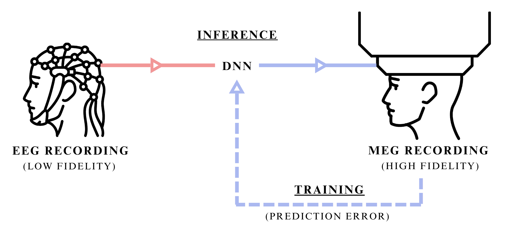
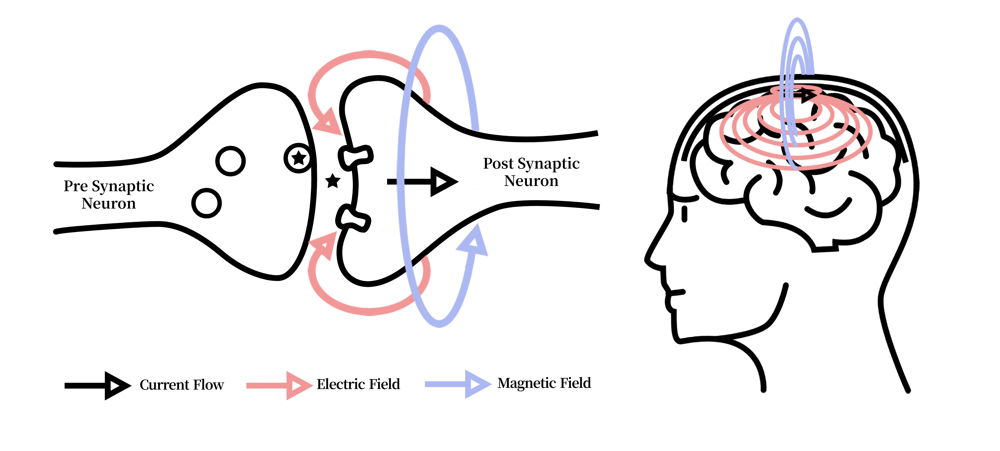
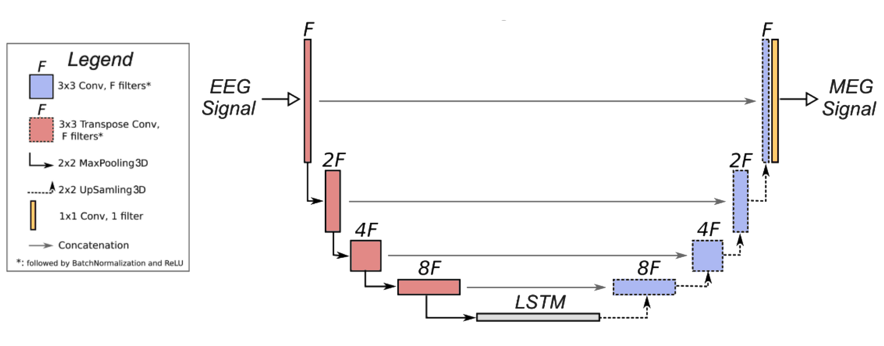
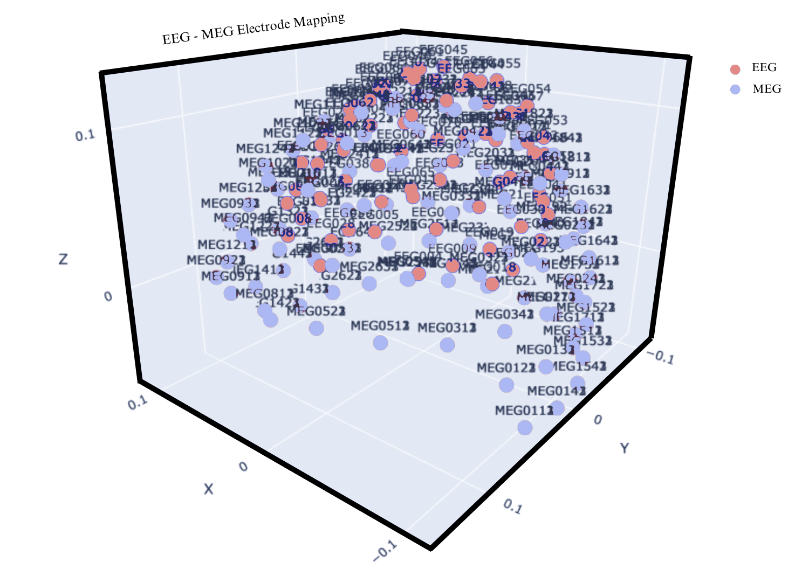
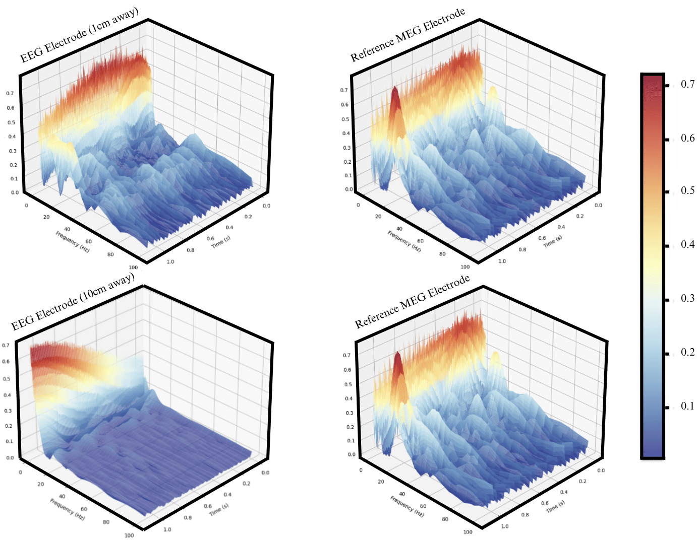
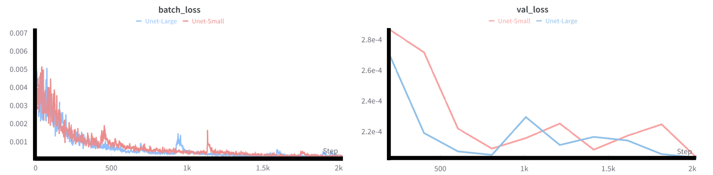

 

  <table>
    <tr>
      <td align="center">
        Gleb Razgar 
        <a href="mailto:gleb.razgar@gmail.com">gleb.razgar@gmail.com</a>
      </td>
      <td align="center">
        Tim Farkas 
        <a href="mailto:smalzard@turing.ac.uk">timfarhas@ucl.edu</a>
      </td>
    </tr>
  </table>

<h3 align="center">Abstract</h3>

Despite the widespread adoption of neuroimaging, many BCI modalities like EEG remain confined to low-fidelity applications due to persistent noise interference  that contemporary methods have failed to resolve. To address this impasse, we introduce a cross-modal transfer method that leverages higher-fidelity modality during model training to denoise lower-fidelity one through supervised signal translation. Provided that both BCI methods share underlying neurophysiological origins, cross-modal transfer captures signal dependencies and extracts high-resolution features from the superior signal. Using EEG and MEG as a test case, we quantify the transferable signal dependanciy between both modalities and compare it's denoising prowes in improving brain region classification against other methods. At last, we posit future research directions, suggesting broader applications of cross-modal transfer across BCI modalities to enhance their precision and utility.

 

<h3 align="center">1. Introduction</h3>

<h4 style="margin-bottom: 0"><u>1.1 Rational</u></h4>

Why don't most people have a BCI that extends their mind? One that they use on daily basis like headphones, to increase the brains information throughput. As a non-invasive method with high temporal resolution, electroencephalography (EEG) is well-suited for such applications. However, its poor signal-to-noise ratio limits reliable brain region classification, restricting EEG to a subset of possible applications despite numerous advances in denoising techniques.
 

  
<b>Figure 1:</b> Synaptech's cross-modal transfer of EEG signal into MEG signal of higher-fideligty. Illustration showing both the inference stage, where only the modality at hand is used to predict a higher resolution mode, and traning stage, where the DNN uses both signals to learn their dependancies. 

 

These span a spectrum of approaches: from classical signal processing methods like bandpass filtering and Independent Component Analysis, through statistical techniques such as wavelet decomposition, to contemporary deep learning models including convolutional neural networks and generative adversarial networks that can dynamically parse and remove noise while preserving the intricate neurophysiological signal characteristics. 

<h4 style="margin-bottom: 0"><u>1.2 Theoretical Idealism</u></h4>
Theoretically, with a wholistic knowledge of both pure and noise signal’s independent statistical properties, and ability to distinguish between the two at a quantum level resolution, the best way to de-noise the signal would be to use a filter that optimally separates signal from noise by frequency components based on their power spectral densities, applying frequency-domain suppression proportional to the local signal-to-noise ratio, ensuring that regions with higher signal prominence are preserved while noise-dominant frequencies are attenuated. This can sometimes be approximated using Wiener-Kolmogorov filter which optimally separates signal from noise given their statistical properties, but with incomplete information, these signals can’t be treated as independent, and thereby its utility in the real world yet remains inadequate. 

<h4 style="margin-bottom: 0"><u>1.3 Synaptech</u></h4>
We propose Synaptech as a cross-modal signal translation method that leverages modalities with shared neurophysiological origins but different noise characteristics. Synaptech enables more precise signal-noise separation compared to traditional denoising techniques by learning the mapping between a lower-fidelity and higher-fidelity modality. The principle is analogous to supervised denoising: given paired clean and noisy signals, a model learns the transformation function between them. This generalizes to cross-modal translation when the modalities share underlying temporal or spatial dependencies while exhibiting different signal-to-noise ratios.

 

  
<b>Figure 2:</b> Illustration of the electric current in neurons causing electric fields which in turn derive magnetic fields. Both signals originate from the same ionic current derivatives, but magnetic fields propagate through tissue without distortion, enabling cross-modal fidelity transfer.

 
<h4 style="margin-bottom: 0"><u>1.4 Selected Modalities </u></h4>
The exemplar modalities chosen for this study are EEG and MEG due to their derivative signal origin and isomorphic temporal resolution. Both MEG and EEG signals originate from the net effect of ionic currents flowing in the dendrites of neurons. Whilst EEG measures changes in electric fields and MEG measures variations in magnetic fields, one directly derives from another (Figure 2).  

An advantage of MEG over EEG is that the magnetic fields are not distorted by the intervening organic matter, as is the case with electric fields, which makes MEG much more accurate. On the other hand, MEG systems are considerably more expensive, rare, bulky and non-portable. Due to these reasons it’s extremely desirable to gain MEG like quality on EEG headsets through the act of de-noising. This paper attempts to accomplish exactly that throgh cross-modal transfer that leverages a higher SNR modality as a supervisory signal, thereby enhancing the target BCI modality.

<h4 style="margin-bottom: 0"><u>1.5 Organization of This Paper</u></h4>

This paper is structured as follows:  
- **Section 1** introduces the cross-modal transfer.  
- **Section 2** reviews signal processing techniques, deep learning approaches, and cross-modal methods in BCI denoising.  
- **Section 3** presents Synaptech's architecture and theoretical framework for cross-modal signal translation.  
- **Section 4** details experimental methodology, including electrode selection, mutual information analysis, and evaluation metrics.  
- **Section 5** analyzes results across signal fidelity, reconstruction accuracy, and classification performance.  
- **Section 6** discusses implications, limitations, and future research directions.  

<h3 style="text-align: center;">2. Backgroung and Related Work</h3>

<h4 style="margin-bottom: 0"><u>2.1 EEG Signal Processing Techniques</u></h4>
EEG signal processing has seen a set of methods intended to mitigate noise sources, including muscle artifacts, environmental interference, and inherent instrument limitations. Early approaches involved classical filtering—such as low-pass, high-pass, or bandpass filters—to focus on specific frequency bands (e.g., alpha, beta, gamma) where meaningful neurophysiological activity is dominant [1]. Independent Component Analysis (ICA) [2], intends to disentangle superimposed source signals based on assumptions of mutual statistical independence. More sophisticated approaches like wavelet transform have been used to decompose the signal for precise time-frequency analysis, allowing different segments of the signal to undergo tailored noise reduction [3].

Further refinements in classical techniques include canonical correlation analysis for artifact subspace separation [4] and spatial filtering (such as beamformers [5]) that emphasize specific cortical sources while suppressing external interference. However, each technique has its own set of limits. Traditional filtering relies on preselected cutoff frequencies that don’t generalize to all contexts, while ICA is sensitive to algorithmic selections and non-Gaussianity. Wavelet decompositions require domain expertise in choosing suitable mother wavelets and in defining thresholding schemes, which abolishes them from large-scale or automated applications. Thus, the neuroimaging field is still converging on more robust methods.

<h4 style="margin-bottom: 0"><u>2.2 Deep Learning for Neural Signal Cleaning</u></h4>
Recent deep learning (DL) methods have attempted to improve on traditional EEG denoising algorithms (e.g., wavelet thresholding or ICA) by automatically learning complex mappings between noisy signals and their cleaner representations. Early CNN-based frameworks, such as Schirrmeister et al. [6], showed the feasibility of end-to-end filtering in the spatial dimension. However, these approaches have at large been superseded by hybrid architectures that integrate temporal modeling. For instance, architectures merging convolutional front-ends with LSTM or GRUs can also capture long-range dependencies needed to isolate artifacts spanning multiple time steps. Such hybrid designs have shown better performance on tasks involving nonstationary noise sources like motion artifacts or power-line interference [9], but still struggle from the artifacts present in most data.

The scarcity of ground-truth noise-less EEG recordings has motivated the self-supervised trend that followed. Masking random signal segments and learning to reconstruct them has been used to coerce models to encode richer temporal and frequency details [10]. Contrastive learning schemes further refined latent representations by distinguishing genuine neural patterns from simulated artifacts. Generative adversarial networks (GANs) and their time-series counterparts TimeGAN have also been explored for EEG denoising due to their ability to learn spatiotemporal correlations through adversarial training, where the discriminator learns to identify subtle statistical deviations from clean signal characteristics. Nevertheless, single-modal approaches—however advanced—are constrained by the limited fidelity of EEG as the sole training signal. These EEG-only methods still risk modelling artifacts as valid signals due the statistical entanglement between neural activity and noise in spectrotemporal domains.

<h4 style="margin-bottom: 0"><u>2.3 Multi-modal and Cross-Modal Learning inference</u></h4>
The specific area of DL denoising that has shown most promise combines multiple neuroimaging modalities, and can be broadly split into two main approaches:
Simultaneous multi-modal inference and Cross-modal translation.  

Multi-modal inference architectures process concurrent recordings from different modalities to improve classification or detection tasks. In the EEG-fNIRS domain, Chiarelli et al. [18] developed a hybrid CNN-LSTM architecture that improved motor imagery classification by 15% over single-modal approaches by combining EEG's temporal precision with fNIRS's spatial resolution. Similarly, Zhang et al. [19] demonstrated that EEG-fMRI inference through cross-attention networks could enhance source localization accuracy, particularly in deep brain regions where EEG signals are traditionally weak.

Of particular relevance to our work are cross-modal translation approaches, which aim to synthesize signals from one modality using another. Zich et al. [20] showed that MEG-informed EEG processing improves detection of subtle temporal features in motor cortex activation patterns through a dual-stream architecture that learned shared spectro-temporal representations. Their approach achieved a 12% improvement in temporal precision for motor event detection. Subsequent work by Henson et al. [21] extended this concept using variational autoencoders to learn a shared latent space between MEG and EEG signals with the goal of fusing them to improve source localization. These methods validate that cross-modal learning between electrophysiological signals can leverage their different noise characteristics and spatial sensitivities, but they require concurrent MEG-EEG recordings during inference, limiting their practical application when only EEG-imaging is available.

<h4 style="margin-bottom: 0"><u>2.4 Research Gaps Addressed by This Work</u></h4>

Beyond these methodological advances core limitations endure:

1.	**Statistical Entanglement**: Fully de-coupling neurological signal and residual artifacts from a solitary source is in-tractable.
2.	**Dependancy Measurement**: Prior work lacks rigorous quantification of cross-modal signal dependencies to asess it's usefulness.
3.	**Practicality**: In the real-world scenario where only a single imaging method is available the current multi-modal and cross-modal techniques are redundant. 

Building on this body of work, our approach focuses on EEG-to-MEG translation, where during training the model learns a noise de-coupling function, and during inference can seperate EEG's noise by translating it inot a cleaner modality.

<h3 align="center">3.Methodology</h3>

<h4 style="margin-bottom: 0"><u>3.1 Model Architecture</u></h4> 
To achive neurological signal to signal conversion with a minimum amount of available data this study proposes a new model architecture – Synaptech-Net aimed at capturing both special and temporal characteristics of neurological signal [Fig 2].
Synaptech-Net is a U-Net – LSTM symbiote that utilizes the modified convolutional down sampling layers to capture special correlations, which then feed into a bi-directional LSTM bottleneck that captures temporal dependencies. On the other end, the classic U-net skip connections give the network an option to preserve spatial information of the signal, and simply overlay it with required changes, which makes the model highly parameter efficient. At last, to map a smaller number of EEG electrodes (74) onto the larger array of MAG sensors (102), the networks de-coder block up-samples electrode dimensions, thereby increasing the outputs special resolution.
 

<b>Figure 3:</b> Synaptech-Net architecture — a modified U-Net with an LSTM bridge that maps EEG to MEG signals by combining spatial convolutions and temporal modeling.

 

Though in this paper we run experiments on different SynaptechNet sizes, the core model elements and their purpose is structured as follows:
1. **Spatial Encoder**: A modified U-Net downsampling path processes the input EEG signal (74 channels × T timepoints) through four consecutive blocks. Each block comprises:
   - 2D convolution (kernel: 3×3, stride: 1)
   - Instance normalization
   - LeakyReLU activation (α=0.2)
   - Max pooling (2×2)
   The channel dimensionality follows [74 → 128 → 256 → 512], progressively extracting hierarchical spatial features.

2. **Temporal Bridge**: The encoded representations feed into a bi-directional LSTM module that processes sequences of spatial features. This bridge consists of:
   - 2 stacked Bi-LSTM layers (hidden size: 512)
   - Dropout (p=0.2) between layers
   - Skip connections preserving temporal information flow
   This component captures long-range temporal dependencies crucial for neural signal translation.

3. **Spatial Decoder**: The temporal features are unsampled through a modified U-Net decoder path to reconstruct the MEG signal space. Each block includes:
   - 2D transposed convolution (kernel: 4×4, stride: 2)
   - Instance normalization
   - ReLU activation
   - Skip connections from encoder
   The channel dimensionality contracts [512 → 256 → 128 → 102] to match MEG sensor topology.

<h4 style="margin-bottom: 0"><u>3.2 Dataset</u></h4> 
To train and evaluate our cross-modal network, we use the only publicly available to date dataset containing simultaneous EEG and MEG recordings. This dataset comprises approximately 160 GB of raw neural imaging data collected from 16 participants performing visual recognition tasks.

Experimental Design:
The dataset was collected as part of a study investigating the neural correlates of visual recognition and memory. Participants were presented with images of faces, objects, and scrambled patterns while their neural activity was recorded using simultaneous EEG and MEG. The visual stimuli were designed to evoke distinct neural responses in the visual cortex and higher-order brain regions involved in object recognition and memory encoding. 

Each trial consisted of:  
-	**Stimulus Presentation**: Images were displayed for 500 ms, followed by a 1,500 ms inter-stimulus interval (ISI).  
-	**Task Conditions**: Participants performed either a recognition task (indicating whether they had seen the image before) or a passive viewing task (observing the images without any explicit task).  
-	**Trial Structure**: The experiment included 720 trials per participant, evenly distributed across the three stimulus categories (faces, objects, scrambled patterns).  

Participant Demographics:
The dataset includes recordings from 16 healthy adult participants (8 male, 8 female) aged between 23 and 37 years. All participants had normal or corrected-to-normal vision and no history of neurological or psychiatric disorders. Written informed consent was obtained from all participants prior to the experiment, and the study was approved by the local ethics committee.  

Recording Protocols:  
1.	**EEG Recording**: EEG data were acquired using a 70-channel EasyCap system with electrodes placed according to the 10-10 international system. The signals were sampled at 1,000 Hz and referenced to the average of all electrodes and impedances were kept below 10 kΩ.  
2.	**MEG Recording**: MEG data were collected using a 306-channel Elekta Neuromag system (102 magnetometers and 204 planar gradiometers) in a magnetically shielded room. The signals were sampled at 1,000 Hz and filtered online with a 0.1–330 Hz bandpass filter. Head position indicators (HPIs) were used to track head movements and ensure accurate co-registration with structural MRI scans.  
3.	**Co-Registration**: High-resolution T1-weighted MRI scans were acquired for each participant to align EEG and MEG data with anatomical landmarks. Fiducial markers (nasion, left/right preauricular points) were used to co-register the EEG and MEG sensor positions with the MRI-derived head model.  

<h4 style="margin-bottom: 0"><u>3.3 Dataset Processing</u></h4> 
Pre-Processing:  

The original Openfmri dataset used in this study was pre-proccessed in the following fashion:  
1.	**Artifact Removal**: Ocular and cardiac artifacts were removed using independent component analysis (ICA) and signal-space projection (SSP) techniques.  
2.	**Filtering**: Both EEG and MEG signals were bandpass-filtered between 0.1 Hz and 100 Hz to focus on physiologically relevant frequency bands.  
3.	**Epoching**: The continuous data were segmented into 2-second epochs centered on stimulus onset, with a 500 ms pre-stimulus baseline for baseline correction.  

Processing:  
To further process the data the raw EEG and MEG signals were transformed into time-frequency representations using continuous wavelet transforms (CWT) with a Complex Morlet wavelet (cmor1.5-1.0). This transformation extracts information from three key frequency bands:  
- Alpha (8-13 Hz)  
- Beta (13-30 Hz)  
-	Gamma (30-100 Hz)  

The frequency range was sampled logarithmically from 1 to 100 Hz to provide coverage of neural oscillations while maintaining computational efficiency.  

Since both modalities operate at different scales, to ensure valid relationships could be learned during training we apply two stage normalization where we:  
stage 1: Min-max normalize both signals separately   
stage 2: log-1-transform MEG data to equally distribute its normalized values.  

<h4 style="margin-bottom: 0"><u>3.4 Training Policies</u></h4> 
We optimize the learning between EEG and MEG conversion using Mean Squared Error (MSE) loss in the time domain, directly targeting signal reconstruction ability.  

Notably, we apply asymmetric model averaging using dropout only to post-pooling in the encoder and post-LSTM in the bridge, while omitting it in the decoder pathway. This asymmetric regularization preserves temporal coherence during reconstruction while preventing feature co-adaptation during encoding.  

The Adam optimizer per-parameter learning rate adaptation is particularly beneficial for our U-Net architecture, where different layers (especially in the encoder and decoder paths) may require different scales of updates. It’s adaptive behaviour helps when learning the complex mapping between EEG's lower signal-to-noise ratio and MEG's higher fidelity signals, as gradient magnitudes can vary significantly across different frequency components and temporal scales.  

In short, this paper’s contributions are as follows:  
1.	We quantify the transferability of EEG and MEG signals.  
2.	We introduce cross-modal learning as a theoretical framework for BCI signal enhancement.  
3.	We develop and test an MEG to EEG cross-modal transfer architecture.  

<h3 align="center">4. Experimental Setup</h3>
Synaptech is evaluated across three dimensions:  

1. **Signal Mutual Information**
2. **Model's signal reconstruction accuracy**
3. **Brain region classification improvement**

<h4 style="margin-bottom: 0"><u>4.1 Electrode Selection</u></h4> 
In creating a reliable mapping between EEG and MEG signal its crucial to have both electrodes be as close to one another as possible, or else they will be detecting un-related brain activity. The OpenFmri’s dataset wasn’t originally collected with cross-modal transfer in mind, and thus lacks accurate placement of electrodes with the aim of minimizing the electrode distances. On top of it, geo-positional data required to calculate the distance between different electrode types is corrupted and such to make sure mapping electrodes match their closest counterpart we address this in two ways:  

A.  We prune un-related electrodes based on Eucledian distance threasholds.  
B.	We quantify the transferable signal across EEG and MEG electrodes to make sure the signal shares capturable dependancies.  
 

<b>Figure 4:</b> The plot shows EEG and MEG electrode overlay before prewning, demonstrating massive variability in electrode mappings. 

 

Apart from the threshold, MEG electrode selection was optimized for cortical geometry. MEG exhibits maximal sensitivity to tangential neural currents, particularly those originating from sulcal sources, due to the orthogonal orientation of magnetic fields relative to electrical current flow. Therefore, sensors positioned above major cortical folds, like longitudinal fissure or Sylvian fissure were manually prioritized for analysis.
 

<b>Figure 5:</b> Signal wavelets showing signal similarity between near by electrodes. 

 

When observing the waveleted signal between EEG and MEG electrodes in close proximity, it's clear that there is some resemblance in the signal when asessed visually (Figure 5). However, the level of information varies depending on the distance between electrodes (Figure 5). As such we poise to quantify the shared information between both modalities across distances.

Shared information is best measured through Mututal Information. In the context of this study, MI provides a metric for assessing the degree of dependency between these modalities and thus tells us how much information about the MEG signal can be inferred from the EEG signal.  

The formula for Mutual Information (MI) is given by:  

$$I(X;Y) = H(X) - H(X\|Y)$$

Where:
- $H(X)$ represents the entropy of the EEG signal, quantifying its overall information content.
- $H(X\|Y)$ is the conditional entropy of the EEG signal given the MEG signal, measuring the residual uncertainty in EEG after considering the influence of MEG.

<h3 align="center">6. Results</h3>

<h4 style="margin-bottom: 0"><u>6.1 Mutual Information Analysis</u></h4> 
The efficacy of the cross signal similarity is compared by incrementally increasing the distance between a target MEG electrode and a set of reference EEG electrodes, upon which MI is computed. The optimal MI score is determined and chosen by calculating mutual information across a range of time lags to account for potential temporal differences between modalities.

  <svg width="700" height="500" viewBox="0 0 700 500" style="max-width: 100%;">
    <!-- Title -->
    <text x="350" y="40" text-anchor="middle" style="font-size: 20px; font-family: 'Times New Roman', Times, serif; font-weight: bold;">Mutual Information vs. Electrode Distance</text>
    <!-- Axes -->
    <line x1="100" y1="400" x2="600" y2="400" style="stroke: black; stroke-width: 2;"></line>
    <line x1="100" y1="100" x2="100" y2="400" style="stroke: black; stroke-width: 2;"></line>
    <!-- Y-axis labels -->
    <g style="font-size: 14px; font-family: Arial, sans-serif;">
      <text x="90" y="400" text-anchor="end">0.00</text>
      <text x="90" y="340" text-anchor="end">0.02</text>
      <text x="90" y="280" text-anchor="end">0.04</text>
      <text x="90" y="220" text-anchor="end">0.06</text>
      <text x="90" y="160" text-anchor="end">0.08</text>
      <text x="90" y="100" text-anchor="end">0.10</text>
    </g>
    <!-- X-axis labels -->
    <g style="font-size: 14px; font-family: Arial, sans-serif;">
      <text x="130" y="420" text-anchor="middle">2 cm</text>
      <text x="210" y="420" text-anchor="middle">4 cm</text>
      <text x="290" y="420" text-anchor="middle">6 cm</text>
      <text x="370" y="420" text-anchor="middle">8 cm</text>
      <text x="450" y="420" text-anchor="middle">10 cm</text>
      <text x="530" y="420" text-anchor="middle">12 cm</text>
    </g>
    <!-- Bars -->
    <rect x="110" y="110" width="40" height="290" style="fill: #D98B8B;"></rect>
    <rect x="190" y="260" width="40" height="140" style="fill: #D98B8B;"></rect>
    <rect x="270" y="310" width="40" height="90" style="fill: #D98B8B;"></rect>
    <rect x="350" y="350" width="40" height="50" style="fill: #D98B8B;"></rect>
    <rect x="430" y="332" width="40" height="68" style="fill: #D98B8B;"></rect>
    <rect x="510" y="336" width="40" height="64" style="fill: #D98B8B;"></rect>
    <!-- Y-axis label -->
    <text x="50" y="250" text-anchor="middle" transform="rotate(-90 50,250)" style="font-size: 16px; font-family: Arial, sans-serif;">Mutual Information (bits)</text>
    <!-- X-axis label -->
    <text x="350" y="460" text-anchor="middle" style="font-size: 16px; font-family: Arial, sans-serif;">Distance (cm)</text>
  </svg>

  <b>Figure 6:</b> Mutual Information between EEG Electrode 'Fz' and MEG Electrodes at Increasing Distances. The bar chart illustrates the exponential decrease in mutual information, followed by a slower decline as the distance increases.

 

The results in Figure 6 show that the MI scores is a function of electrode distance. Quantitatively, the MI score decreases by approximately 50% when the electrode distance increase from 2 cm to 4 cm, and after 8 cm, the rate of change staled out, suggesting most mutual information is power-law distributed.
The effects of spatial dynamics of mutual information, is further explored in the Discussion section.

To further substantiate these findings, Transfer Entropy was measured to assess the directional information flow from electric field to magnetic field. TE analysis tells the same storry observed in the MI results, showing an identical trend where information flow decreases exponentially with increased electrode distance.

<h4 style="margin-bottom: 0"><u>6.2 Signal Reconstruction Accuracy</u></h4> 
Building on top of Mutual Information, we assess our model's ability to capture this mutual dependency and translate EEG signals into MEG representations. This is done by observing the MSE between the predicted and the ground truth signal thorough model training on the validation set. 

 

<b>Figure 7:</b> Training and validation loss curves over 10 epochs, showing model convergance.

 

At first sight the model successfully reduces the MSE loss in the expected exponential fasion. However taking into account that the data is normalized to be between zero and one, looking at the values of reduction it's clear that the model memorizes the data, as the error decline on the training and validation set close to null, suggesting more data is needed for model training. 

Though we've tried combating this this by increaing the electrode count, it other unstable electrodes with lower mutual information scores proved to worsen the models generalizability. 

<h4 style="margin-bottom: 0"><u>6.5 Brain Region Classification Accuracy</u></h4> 

As a final showdown we test Synaptech's prowess in improving brain region classification of a standard CNN classifier through active denoising.
 

  <table cellspacing="0" cellpadding="6" border="1" style="border: 1px solid black; border-collapse: collapse; width: 100%;">
    <caption style="caption-side: top; padding: 10px;"><b>Table 1.</b> Brain Region Classification Comparison.</caption>
    <thead>
      <tr>
        <th style="border: 1px solid black;">Condition</th>
        <th style="border: 1px solid black;">Method</th>
        <th style="border: 1px solid black;">Brain Region</th>
        <th style="border: 1px solid black;">Activation Metric (μV)</th>
        <th style="border: 1px solid black;">Classification Accuracy (%)</th>
      </tr>
    </thead>
    <tbody>
      <!-- Familiar Faces -->
      <tr>
        <td style="border: 1px solid black;" rowspan="3">Familiar Faces</td>
        <td style="border: 1px solid black;">Raw EEG</td>
        <td style="border: 1px solid black;">FFA</td>
        <td style="border: 1px solid black;">2.5</td>
        <td style="border: 1px solid black;">78%</td>
      </tr>
      <tr>
        <td style="border: 1px solid black;">Classic Denoising (ICA)</td>
        <td style="border: 1px solid black;">FFA</td>
        <td style="border: 1px solid black;">3.0</td>
        <td style="border: 1px solid black;">85%</td>
      </tr>
      <tr>
        <td style="border: 1px solid black;">Synaptech</td>
        <td style="border: 1px solid black;">FFA</td>
        <td style="border: 1px solid black;">1.0</td>
        <td style="border: 1px solid black;">37%</td>
      </tr>
      <!-- Unfamiliar Faces -->
      <tr>
        <td style="border: 1px solid black;" rowspan="3">Unfamiliar Faces</td>
        <td style="border: 1px solid black;">Raw EEG</td>
        <td style="border: 1px solid black;">OFA</td>
        <td style="border: 1px solid black;">2.0</td>
        <td style="border: 1px solid black;">74%</td>
      </tr>
      <tr>
        <td style="border: 1px solid black;">Classic Denoising (ICA)</td>
        <td style="border: 1px solid black;">OFA</td>
        <td style="border: 1px solid black;">2.7</td>
        <td style="border: 1px solid black;">82%</td>
      </tr>
      <tr>
        <td style="border: 1px solid black;">Synaptech</td>
        <td style="border: 1px solid black;">OFA</td>
        <td style="border: 1px solid black;">0.8</td>
        <td style="border: 1px solid black;">32%</td>
      </tr>
      <!-- Scrambled Faces -->
      <tr>
        <td style="border: 1px solid black;" rowspan="3">Scrambled Faces</td>
        <td style="border: 1px solid black;">Raw EEG</td>
        <td style="border: 1px solid black;">Temporal Pole</td>
        <td style="border: 1px solid black;">1.5</td>
        <td style="border: 1px solid black;">60%</td>
      </tr>
      <tr>
        <td style="border: 1px solid black;">Classic Denoising (ICA)</td>
        <td style="border: 1px solid black;">Temporal Pole</td>
        <td style="border: 1px solid black;">1.9</td>
        <td style="border: 1px solid black;">68%</td>
      </tr>
      <tr>
        <td style="border: 1px solid black;">Synaptech</td>
        <td style="border: 1px solid black;">Temporal Pole</td>
        <td style="border: 1px solid black;">0.6</td>
        <td style="border: 1px solid black;">26%</td>
      </tr>
    </tbody>
  </table>

 
  
<b>Table 1:</b> Comparison of brain region activation performance across different conditions and methods. The classic denoising method (ICA) outperforms both the raw EEG and Synaptech-Net in terms of activation metrics and classification accuracy.

As expected from the models inability to cohesively reconstruct the signal, models performance on classification tasks shows marginal de-noising reulsts at best, given by methods downperformance when compared to ICA. 

<h3 align="center">6. Discussion</h3>

<h4 style="margin-bottom: 0"><u>6.1 Mutual Information Insights</u></h4> 
We find that when both signals are either normalized or standardised MI for near located electrodes tends to be as much as 5x higher. Contrary to our initial hypothesis, the electrodes on the parietal lobe have the strongest MI corelations. This is likely explained by the fact that participants are performing recognition tasks which makes the signal less stochastic in parietal lobe in comparison to other brain regions. Mutual Infofrmation and Transfer Entropy both confirm the cross-modal dependancy of EEG and MEG signals. 

<h4 style="margin-bottom: 0"><u>6.2 Signal Reconstruction Insights</u></h4> 
Despite the apparent ven-diagramatic intersection of both modalities in their mutual information, the model has failed to cohesively learn and generalise to un-seen signal. There are two likely reasons behind this observation. 
1. The insuficciency of data
   - The model's tendency toward memorization rather than generalization suggests insufficient training data. The limited spatial sampling from a single stable electrode appears inadequate for learning robust cross-modal mappings.

2. Lack of dependancy
   - In cases where data availability is not the limiting factor, the model's generalization issue likely stems from insufficient cross-modal signal dependency. While mutual information analysis confirmed shared information between modalities, the spatial stochasticity of electrode placement and inter-electrode distances (2-4cm) appear to degrade the signal correlation below the threshold required for effective cross-modal translation.

<h4 style="margin-bottom: 0"><u>6.5 Limitation of Synaptech Insights</u></h4> 
While Synaptech demonstrates a novel approach for quantifying cross-modal signal dependencies and learning their mapping functions, several limitations warrant discussion.

<h4 style="margin-bottom: 0"><u>6.5 Directions For Future Work</u></h4> 

The primary constraint likely stems from the scarcity of simultaneous EEG-MEG recordings, which currently limits the model's practical implementation. However, this limitation presents opportunities for future research:  

1. The framework could be extended to other modality pairs with a stronger shared neurophysiological origins.
2. Synaptech could be applied to newly harvested and more plentiful simultaneouse EEG-MEG datasets.
3. Initially training the model on non-simultaneouse recordings of both modalities before fine-tuning it on simultaneouse recordings could prove useful.

<h3 align="center">7. Conclusion</h3>

This work introduces three key contributions to the field of BCI signal enhancement:

1. **Quantitative Cross-Modal Analysis**: We present the first comprehensive quantification of mutual information between EEG and MEG signals, demonstrating significant shared information content (up to 0.08 bits) for electrodes within 2-4cm proximity.

2. **Novel Architecture**: We introduce Synaptech-Net, a hybrid U-Net-LSTM architecture specifically designed for neurological signal translation. The architecture's asymmetric regularization and specialized bottleneck demonstrate a new approach to handling cross-modal BCI signal processing.

3. **Theoretical Framework**: We establish a mathematical foundation for cross-modal transfer in BCIs, providing a systematic approach to quantifying signal dependencies between modalities sharing neurophysiological origins.

Expanding on our body of work, we suggest future body of work to focus on:
- Expanding the framework to other BCI modality pairs (e.g., EEG-fNIRS, MEG-ECoG)
- Leveraging larger datasets with precise electrode co-registration
- Exploring self-supervised pre-training on non-simultaneous recordings

While current data limitations constrain practical implementation, this work establishes the theoretical and empirical foundations for cross-modal transfer in BCI enhancement, paving the way for next-generation portable neural interfaces.

While current data limitations constrain practical implementation, this work establishes the theoretical and empirical foundations for cross-modal transfer in BCI enhancement, paving the way for future research.
---

<h3 align="center">8. References</h3>

Our paper's code: [github link](https://github.com/GlebRazgar/AIM)

Bau, D., Zhou, B., Khosla, A., Oliva, A., and Torralba, A. Network
dissection: Quantifying interpretability of deep visual representations.
In Computer Vision and Pattern Recognition, 2017.

Bau, D., Zhu, J.-Y., Strobelt, H., Lapedriza, A., Zhou, B., and
Torralba, A. Understanding the role of individual units in a deep neural
network. Proceedings of the National Academy of Sciences, 2020. ISSN
0027-8424. doi: 10.1073/pnas. 1907375117. URL https://www.pnas.org/
content/early/2020/08/31/1907375117.

Beery, S., Van Horn, G., and Perona, P. Recognition in terra incognita.
In Proceedings of the European conference on computer vision (ECCV), pp.
456--473, 2018.

Bills, S., Cammarata, N., Mossing, D., Tillman, H., Gao, L., Goh, G.,
Sutskever, I., Leike, J., Wu, J., and Saunders, W. Language models can
explain neurons in language models. https:
//openaipublic.blob.core.windows.net/ neuron-explainer/paper/index.html,
2023.

Bissoto, A., Valle, E., and Avila, S. Debiasing skin lesion datasets and
models? not so fast. In Proceedings of the IEEE/CVF Conference on
Computer Vision and Pattern Recognition Workshops, pp. 740--741, 2020.

Brooks, T., Holynski, A., and Efros, A. A. Instructpix2pix: Learning to
follow image editing instructions. arXiv preprint arXiv:2211.09800,
2022.

Caron, M., Touvron, H., Misra, I., Jegou, H., Mairal, J., ´ Bojanowski,
P., and Joulin, A. Emerging properties in self-supervised vision
transformers. In Proceedings of the IEEE/CVF international conference on
computer vision, pp. 9650--9660, 2021.

Casper, S., Hariharan, K., and Hadfield-Menell, D. Diagnostics for deep
neural networks with automated copy/paste attacks. arXiv preprint
arXiv:2211.10024, 2022.

Chen, L., Zhang, Y., Ren, S., Zhao, H., Cai, Z., Wang, Y., Wang, P.,
Liu, T., and Chang, B. Towards end-to-end embodied decision making via
multi-modal large language model: Explorations with gpt4-vision and
beyond, 2023.

Chen, X. and He, K. Exploring simple siamese representation learning. In
Proceedings of the IEEE/CVF conference on computer vision and pattern
recognition, pp. 15750--15758, 2021.

Conmy, A., Mavor-Parker, A. N., Lynch, A., Heimersheim, S., and
Garriga-Alonso, A. Towards automated circuit discovery for mechanistic
interpretability. arXiv preprint arXiv:2304.14997, 2023.

Dalvi, F., Durrani, N., Sajjad, H., Belinkov, Y., Bau, A., and Glass, J.
What is one grain of sand in the desert? analyzing individual neurons in
deep nlp models. In Proceedings of the AAAI Conference on Artificial
Intelligence, volume 33, pp. 6309--6317, 2019.

Deng, J., Dong, W., Socher, R., Li, L.-J., Li, K., and Fei-Fei, L.
Imagenet: A large-scale hierarchical image database. In 2009 IEEE
conference on computer vision and pattern recognition, pp. 248--255.
Ieee, 2009.

Fong, R. and Vedaldi, A. Net2vec: Quantifying and explaining how
concepts are encoded by filters in deep neural networks. In Proceedings
of the IEEE conference on computer vision and pattern recognition, pp.
8730--8738, 2018.

Gandelsman, Y., Efros, A. A., and Steinhardt, J. Interpreting clip's
image representation via text-based decomposition, 2024.

Gardner, M., Artzi, Y., Basmova, V., Berant, J., Bogin, B., Chen, S.,
Dasigi, P., Dua, D., Elazar, Y., Gottumukkala, A., Gupta, N.,
Hajishirzi, H., Ilharco, G., Khashabi, D., Lin, K., Liu, J., Liu, N. F.,
Mulcaire, P., Ning, Q., Singh, S., Smith, N. A., Subramanian, S.,
Tsarfaty, R., Wallace, E., Zhang, A., and Zhou, B. Evaluating models'
local decision boundaries via contrast sets, 2020.

Girshick, R., Donahue, J., Darrell, T., and Malik, J. Rich feature
hierarchies for accurate object detection and semantic segmentation. In
Proceedings of the IEEE conference on computer vision and pattern
recognition, pp. 580--587, 2014.

Grill, J.-B., Strub, F., Altche, F., Tallec, C., Richemond, P., ´
Buchatskaya, E., Doersch, C., Avila Pires, B., Guo, Z., Gheshlaghi Azar,
M., et al. Bootstrap your own latent-a new approach to self-supervised
learning. Advances in neural information processing systems,
33:21271--21284, 2020.

Gupta, T. and Kembhavi, A. Visual programming: Compositional visual
reasoning without training. In Proceedings of the IEEE/CVF Conference on
Computer Vision and Pattern Recognition, pp. 14953--14962, 2023.

Gurnee, W., Nanda, N., Pauly, M., Harvey, K., Troitskii, D., and
Bertsimas, D. Finding neurons in a haystack: Case studies with sparse
probing. arXiv preprint arXiv:2305.01610, 2023.

He, K., Zhang, X., Ren, S., and Sun, J. Deep residual learning for image
recognition. In Proceedings of the IEEE conference on computer vision
and pattern recognition, pp. 770--778, 2016.

Hernandez, E., Schwettmann, S., Bau, D., Bagashvili, T., Torralba, A.,
and Andreas, J. Natural language descriptions of deep visual features.
In International Conference on Learning Representations, 2022.

Huang, J., Geiger, A., D'Oosterlinck, K., Wu, Z., and Potts, C.
Rigorously assessing natural language explanations of neurons. arXiv
preprint arXiv:2309.10312, 2023.

Karpathy, A., Johnson, J., and Fei-Fei, L. Visualizing and understanding
recurrent networks. arXiv preprint arXiv:1506.02078, 2015.

Kaushik, D., Hovy, E., and Lipton, Z. C. Learning the difference that
makes a difference with counterfactuallyaugmented data, 2020.

Kirichenko, P., Izmailov, P., and Wilson, A. G. Last layer re-training
is sufficient for robustness to spurious correlations, 2023.

Kirillov, A., Mintun, E., Ravi, N., Mao, H., Rolland, C., Gustafson, L.,
Xiao, T., Whitehead, S., Berg, A. C., Lo, W.-Y., Dollar, P., and
Girshick, R. Segment anything. ´ arXiv:2304.02643, 2023.

Kluyver, T., Ragan-Kelley, B., Perez, F., Granger, B., Bus- ´ sonnier,
M., Frederic, J., Kelley, K., Hamrick, J., Grout, J., Corlay, S.,
Ivanov, P., Avila, D., Abdalla, S., and Willing, C. Jupyter notebooks --
a publishing format for reproducible computational workflows. In
Loizides, F. and Schmidt, B. (eds.), Positioning and Power in Academic
Publishing: Players, Agents and Agendas, pp. 87 -- 90. IOS Press, 2016.

Liu, S., Zeng, Z., Ren, T., Li, F., Zhang, H., Yang, J., Li, C., Yang,
J., Su, H., Zhu, J., et al. Grounding dino: Marrying dino with grounded
pre-training for open-set object detection. arXiv preprint
arXiv:2303.05499, 2023.

Liu, Z., Luo, P., Wang, X., and Tang, X. Deep learning face attributes
in the wild, 2015.

Lynch, A., Dovonon, G. J.-S., Kaddour, J., and Silva, R. Spawrious: A
benchmark for fine control of spurious correlation biases, 2023.

Mahendran, A. and Vedaldi, A. Understanding deep image representations
by inverting them. In Proceedings of the IEEE conference on computer
vision and pattern recognition, pp. 5188--5196, 2015.

Mu, J. and Andreas, J. Compositional explanations of neurons, 2021.

Nushi, B., Kamar, E., and Horvitz, E. Towards accountable ai: Hybrid
human-machine analyses for characterizing system failure. In Proceedings
of the AAAI Conference on Human Computation and Crowdsourcing, volume 6,
pp. 126--135, 2018.

Oikarinen, T. and Weng, T.-W. Clip-dissect: Automatic description of
neuron representations in deep vision networks. arXiv preprint
arXiv:2204.10965, 2022.

Olah, C., Mordvintsev, A., and Schubert, L. Feature visualization.
Distill, 2(11):e7, 2017.

Olah, C., Cammarata, N., Schubert, L., Goh, G., Petrov, M., and Carter,
S. Zoom in: An introduction to circuits. Distill, 5(3):e00024--001,
2020.

OpenAI. Gpt-4 technical report, 2023a.

OpenAI. Gpt-4v(ision) technical work and authors.
https://openai.com/contributions/ gpt-4v, 2023b. Accessed: \[insert date
of access\].

Paszke, A., Gross, S., Massa, F., Lerer, A., Bradbury, J., Chanan, G.,
Killeen, T., Lin, Z., Gimelshein, N., Antiga, L., et al. Pytorch: An
imperative style, high-performance deep learning library. Advances in
neural information processing systems, 32, 2019.

Pedregosa, F., Varoquaux, G., Gramfort, A., Michel, V., Thirion, B.,
Grisel, O., Blondel, M., Prettenhofer, P., Weiss, R., Dubourg, V.,
Vanderplas, J., Passos, A., Cournapeau, D., Brucher, M., Perrot, M., and
Duchesnay, E. Scikit-learn: Machine learning in Python. Journal of
Machine Learning Research, 12:2825--2830, 2011.

Qin, Y., Liang, S., Ye, Y., Zhu, K., Yan, L., Lu, Y., Lin, Y., Cong, X.,
Tang, X., Qian, B., Zhao, S., Hong, L., Tian, R., Xie, R., Zhou, J.,
Gerstein, M., Li, D., Liu, Z., and Sun, M. Toolllm: Facilitating large
language models to master 16000+ real-world apis, 2023.

Radford, A., Kim, J. W., Hallacy, C., Ramesh, A., Goh, G., Agarwal, S.,
Sastry, G., Askell, A., Mishkin, P., Clark, J., Krueger, G., and
Sutskever, I. Learning transferable visual models from natural language
supervision, 2021.

Rombach, R., Blattmann, A., Lorenz, D., Esser, P., and Ommer, B.
High-resolution image synthesis with latent diffusion models. In
Proceedings of the IEEE/CVF Conference on Computer Vision and Pattern
Recognition (CVPR), pp. 10684--10695, June 2022a.

Rombach, R., Blattmann, A., Lorenz, D., Esser, P., and Ommer, B.
High-resolution image synthesis with latent diffusion models, 2022b.

Sagawa, S., Koh, P. W., Hashimoto, T. B., and Liang, P. Distributionally
robust neural networks for group shifts: On the importance of
regularization for worst-case generalization, 2020.

Schick, T., Dwivedi-Yu, J., Dess'ı, R., Raileanu, R., Lomeli, M.,
Zettlemoyer, L., Cancedda, N., and Scialom, T. Toolformer: Language
models can teach themselves to use tools, 2023.

Schwettmann, S., Hernandez, E., Bau, D., Klein, S., Andreas, J., and
Torralba, A. Toward a visual concept vocabulary for gan latent space. In
Proceedings of the IEEE/CVF International Conference on Computer Vision,
pp. 6804--6812, 2021.

Schwettmann, S., Shaham, T. R., Materzynska, J., Chowdhury, N., Li, S.,
Andreas, J., Bau, D., and Torralba, A. Find: A function description
benchmark for evaluating interpretability methods, 2023.

Sharma, P., Ding, N., Goodman, S., and Soricut, R. Conceptual captions:
A cleaned, hypernymed, image alt-text dataset for automatic image
captioning. In Proceedings of the 56th Annual Meeting of the Association
for Computational Linguistics (Volume 1: Long Papers), pp. 2556-- 2565,
2018.

Singh, C., Hsu, A. R., Antonello, R., Jain, S., Huth, A. G., Yu, B., and
Gao, J. Explaining black box text modules in natural language with
language models, 2023.

Singla, S., Nushi, B., Shah, S., Kamar, E., and Horvitz, E.
Understanding failures of deep networks via robust feature extraction.
In Proceedings of the IEEE/CVF Conference on Computer Vision and Pattern
Recognition, pp. 12853--12862, 2021.

Storkey, A. et al. When training and test sets are different:
characterizing learning transfer. Dataset shift in machine learning,
30(3-28):6, 2009.

Sur´ıs, D., Menon, S., and Vondrick, C. Vipergpt: Visual inference via
python execution for reasoning, 2023.

Vaughan, J. W. and Wallach, H. A human-centered agenda for intelligible
machine learning. Machines We Trust: Getting Along with Artificial
Intelligence, 2020.

Wah, C., Branson, S., Welinder, P., Perona, P., and Belongie, S. The
Caltech-UCSD Birds-200-2011 Dataset. Caltech Vision Lab, Jul 2011.

Wu, C., Yin, S., Qi, W., Wang, X., Tang, Z., and Duan, N. Visual
chatgpt: Talking, drawing and editing with visual foundation models,
2023.

Xiao, K., Engstrom, L., Ilyas, A., and Madry, A. Noise or signal: The
role of image backgrounds in object recognition. arXiv preprint
arXiv:2006.09994, 2020.

Yang, Y., Panagopoulou, A., Zhou, S., Jin, D., CallisonBurch, C., and
Yatskar, M. Language in a bottle: Language model guided concept
bottlenecks for interpretable image classification, 2023.

Yao, S., Zhao, J., Yu, D., Du, N., Shafran, I., Narasimhan, K., and Cao,
Y. React: Synergizing reasoning and acting in language models, 2023.

Zeiler, M. D. and Fergus, R. Visualizing and understanding convolutional
networks. In Computer Vision--ECCV 2014: 13th European Conference,
Zurich, Switzerland, September 6-12, 2014, Proceedings, Part I 13, pp.
818-- 833. Springer, 2014.

Zhang, J., Wang, Y., Molino, P., Li, L., and Ebert, D. S. Manifold: A
model-agnostic framework for interpretation and diagnosis of machine
learning models. IEEE transactions on visualization and computer
graphics, 25 (1):364--373, 2018.

Zheng, B., Gou, B., Kil, J., Sun, H., and Su, Y. Gpt-4v(ision) is a
generalist web agent, if grounded, 2024.

Zou, X., Yang, J., Zhang, H., Li, F., Li, L., Wang, J., Wang, L., Gao,
J., and Lee, Y. J. Segment everything everywhere all at once, 2023.
