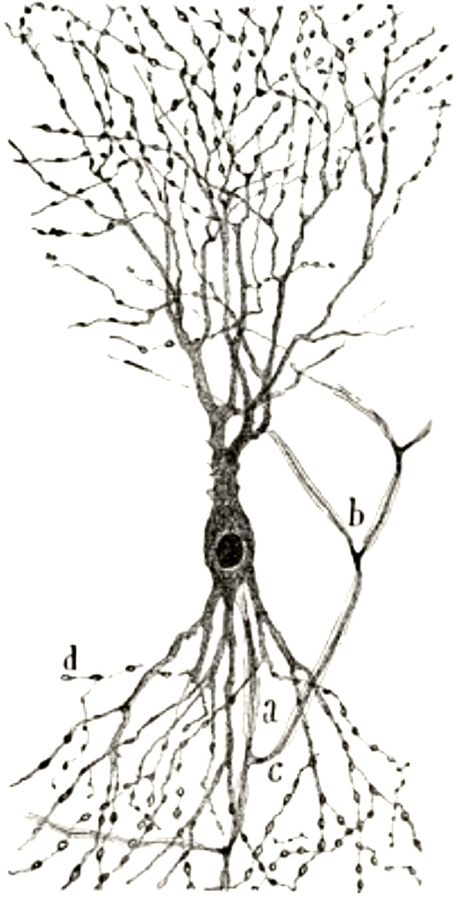

AI x Neurotech    I     Accelerating brain uploading     I     P(AIB)=P(BIA)*P(A)/P(B)

<!-- Side images - only visible on desktop -->

<!-- Left side image -->

  

<!-- Right side image -->

  

<h2 class="section-title">Research</h2>

<ul class="research-list">


  <li>
    <a href="{{ research.url }}">{{ research.title }}</a> - {{ research.date | date: "%B %d, %Y" }}
  </li>

</ul>

<h2 class="section-title">Posts</h2>

<ul class="posts-list">


  <li>
    <a href="{{ post.url }}">{{ post.title }}</a> - {{ post.date | date: "%B %d, %Y" }}
  </li>

</ul>