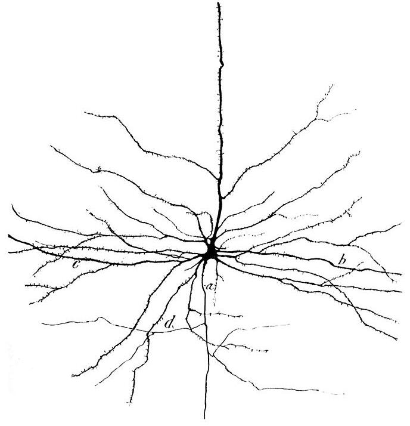

AI x Neurotech    I     Conquering the universe     I     P(AIB)=P(BIA)*P(A)/P(B)

<h2 class="section-title">Research</h2>

<ol class="entry-list">


  <li>
    <a class="entry-title" href="{{ research.url }}">{{ research.title }}</a>
    
{{ research.date | date: "%B %d, %Y" }}

  </li>

</ol>

<h2 class="section-title">Posts</h2>

<ol class="entry-list">


  <li>
    <a class="entry-title" href="{{ post.url }}">{{ post.title }}</a>
    
{{ post.date | date: "%B %d, %Y" }}

  </li>

</ol>

<h2 class="section-title">Wanderings</h2>

<ol class="entry-list">


  <li>
    <a class="entry-title" href="{{ entry.url }}">{{ entry.title }}</a>
    
{{ entry.date | date: "%B %d, %Y" }}

  </li>

</ol>

<!-- Added image below Posts section -->

  

